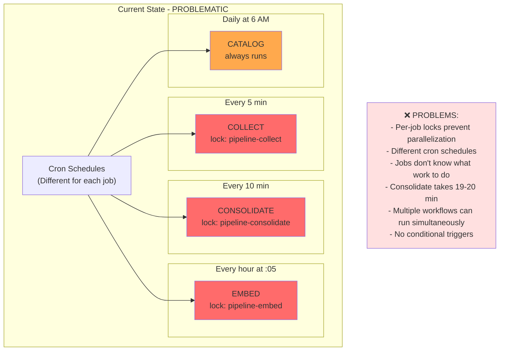
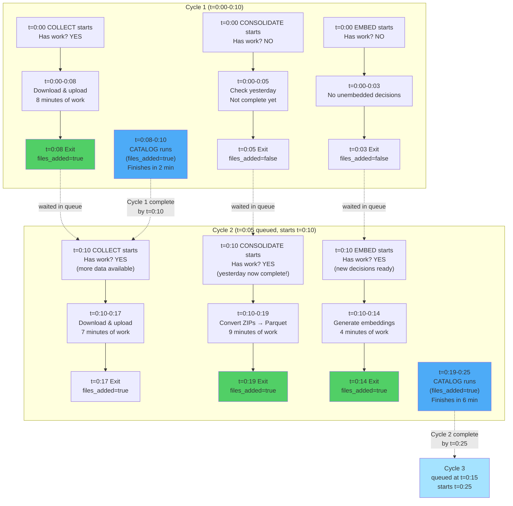
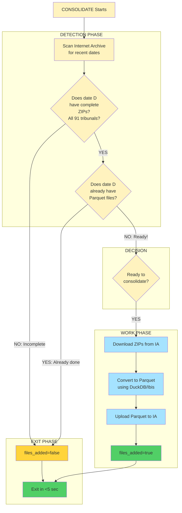
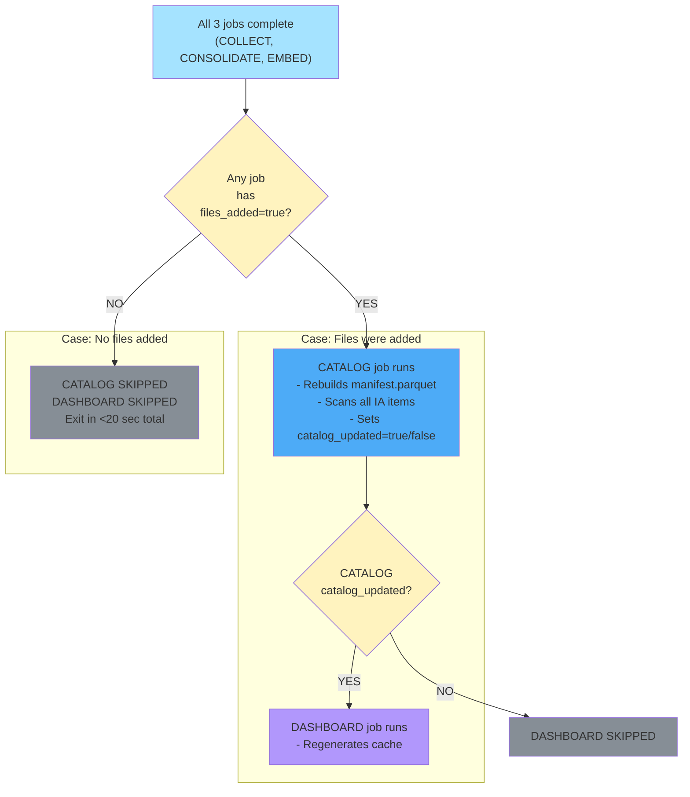
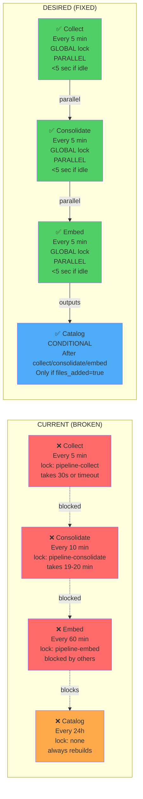

# CausaGanha Data Pipeline Architecture

## Mission: Backfill Campaign (24/7 Data Collection)

```
GOAL: Collect years of historical DJEN data continuously
APPROACH: Self-aware, rate-limited jobs that work in parallel
CONSTRAINT: Each job finishes in <10 min to allow others to run next cycle

Timeline:
- Cycle every 5 minutes
- Each job works for up to 10 minutes
- Then exits to let other jobs run
- Gradually fills entire backlog
```

---

## Current (Broken) Architecture



## Desired (Fixed) Architecture - Time-Sliced Backfill

```mermaid
graph TD
    subgraph "BACKFILL PHASE (Now - 24/7)"
        Schedule["Every 5 minutes<br/>(continuous harvest)"]

        Lock["🔒 GLOBAL LOCK<br/>Only 1 workflow at a time<br/>group: pipeline-global"]

        Schedule --> Lock

        subgraph "ALL IN PARALLEL (Timeout: 10 minutes)"
            Collect["COLLECT<br/>- Work for UP TO 10 min<br/>- Download from DJEN<br/>- Upload to IA<br/>- Exit when done or time runs out<br/>- Output: files_added=true/false"]

            Consolidate["CONSOLIDATE<br/>- Work for UP TO 10 min<br/>- Convert complete days<br/>- Exit when done or time runs out<br/>- Output: files_added=true/false"]

            Embed["EMBED<br/>- Work for UP TO 10 min<br/>- Generate embeddings<br/>- Exit when done or time runs out<br/>- Output: files_added=true/false"]
        end

        Lock --> Collect
        Lock --> Consolidate
        Lock --> Embed

        Collect -.->|parallel| Consolidate
        Consolidate -.->|parallel| Embed
        Embed -.->|outputs| DependCheck{Any files added?}

        DependCheck -->|YES| Catalog["CATALOG<br/>- Rebuild manifest<br/>- Takes ~5-15 min<br/>- Output: catalog_updated=true/false"]
        DependCheck -->|NO| SkipCatalog["SKIP CATALOG"]

        Catalog --> DashCheck{Catalog updated?}
        DashCheck -->|YES| Dashboard["DASHBOARD-CACHE<br/>- Regenerate"]
        DashCheck -->|NO| SkipDash["SKIP DASHBOARD"]

        style Collect fill:#51cf66
        style Consolidate fill:#51cf66
        style Embed fill:#51cf66
        style Catalog fill:#4dabf7
        style Dashboard fill:#b197fc
        style SkipCatalog fill:#868e96
        style SkipDash fill:#868e96
    end

    Benefits["✅ BENEFITS FOR BACKFILL:<br/>- Continuous 24/7 harvesting<br/>- Each job gets turn every 5 min<br/>- No starvation (alternating priority)<br/>- Gradual coverage of years of data<br/>- Self-healing (incomplete days caught later)<br/>- Observable progress"]

    style Benefits fill:#e0f2e0
```



---

## Current (Broken) Architecture



```mermaid
graph TD
    subgraph "Fixed State - CORRECT"
        Schedule["Single Global Schedule<br/>Every 5 minutes"]

        Lock["🔒 GLOBAL CONCURRENCY LOCK<br/>Only 1 workflow runs at a time<br/>group: pipeline-global<br/>cancel-in-progress: false"]

        Schedule --> Lock

        subgraph "Within Same Workflow - ALL IN PARALLEL"
            Collect["COLLECT<br/>- Check: New DJEN data?<br/>- If YES → Download & Upload<br/>- If NO → Exit in <5 sec<br/>- Output: files_added=true/false"]

            Consolidate["CONSOLIDATE<br/>- Check: Complete day ready?<br/>- If YES → Convert to Parquet<br/>- If NO → Exit in <5 sec<br/>- Output: files_added=true/false"]

            Embed["EMBED<br/>- Check: Unembedded decisions?<br/>- If YES → Generate embeddings<br/>- If NO → Exit in <5 sec<br/>- Output: files_added=true/false"]
        end

        Lock --> Collect
        Lock --> Consolidate
        Lock --> Embed

        Collect -.->|async| Consolidate
        Consolidate -.->|async| Embed
        Embed -.->|async| DependCheck{Any files added?}

        DependCheck -->|YES| Catalog["CATALOG<br/>- Rebuild manifest<br/>- Output: catalog_updated=true/false"]
        DependCheck -->|NO| Skip["⏭️ SKIP CATALOG"]

        Catalog --> DashCheck{Catalog Updated?}
        DashCheck -->|YES| Dashboard["DASHBOARD-CACHE<br/>- Regenerate cache"]
        DashCheck -->|NO| SkipDash["⏭️ SKIP DASHBOARD"]

        style Collect fill:#51cf66
        style Consolidate fill:#51cf66
        style Embed fill:#51cf66
        style Catalog fill:#4dabf7
        style Dashboard fill:#b197fc
        style Skip fill:#868e96
        style SkipDash fill:#868e96
    end

    Benefits["✅ BENEFITS:<br/>- Global lock prevents workflow overlap<br/>- All 3 jobs run simultaneously<br/>- Each job is self-aware (checks for work)<br/>- Idle pipeline: <20 seconds<br/>- Active pipeline: <25 minutes<br/>- Catalog only runs if needed<br/>- Dashboard only updates when necessary"]

    style Benefits fill:#e0f2e0
```

## Time-Sliced Parallel Execution (Key Innovation)



**Key Pattern**:
- Jobs exit in <10 min, REGARDLESS of remaining work
- Next cycle (5 min later if available), job runs AGAIN with fresh opportunity
- Consolidation gets turn once Collect added enough ZIPs
- Embedding gets turn once Consolidation created Parquet files
- **Over time**: Entire backlog processed incrementally

---

## Job Execution Timeline (Original)

```mermaid
timeline
    title Workflow Execution Timeline (Ideal)

    section "t=0s: Workflow Starts"
        ALL THREE JOBS START IN PARALLEL

    section "t=0-5s: FAST PATH (Check for work)"
        COLLECT checks DJEN API (✅ Quick)
        CONSOLIDATE checks IA for complete days (✅ Quick)
        EMBED checks for unembedded decisions (✅ Quick)

    section "Case A: NO work needed (Idle)"
        All 3 jobs exit with files_added=false
        CATALOG is SKIPPED
        DASHBOARD is SKIPPED
        TOTAL TIME: 5-20 seconds

    section "Case B: COLLECT has work"
        COLLECT downloads ZIPs (10-30 sec)
        CONSOLIDATE finishes early (5 sec)
        EMBED finishes early (5 sec)
        CONSOLIDATE sets files_added=true
        CATALOG RUNS (indexes new ZIPs)
        DASHBOARD UPDATES
        TOTAL TIME: ~2-5 minutes

    section "Case C: All jobs have work"
        COLLECT downloads (20 sec)
        CONSOLIDATE converts to Parquet (10 min)
        EMBED generates embeddings (15 min)
        All set files_added=true
        CATALOG RUNS (15 min)
        DASHBOARD UPDATES (30 sec)
        TOTAL TIME: ~20-25 minutes
```

## Job Decision Logic (Each Job) - With 10-Minute Exit

```mermaid
flowchart TD
    Start["Job Starts<br/>(Every 5 min in same workflow)"]
    StartTime["Set: deadline = now + 10 minutes"]

    subgraph "CHECK PHASE (<5 seconds)"
        Check["Does this job have work?<br/>(Job-specific logic)"]
    end

    subgraph "WORK PHASE (if needed)"
        Work["Process 1 item/batch<br/>Upload to IA"]
        TimeCheck{Time check:<br/>now() <<br/>deadline?}
        MoreWork{More work<br/>available?}
    end

    subgraph "EXIT PHASE"
        NoWork["No work found<br/>files_added=false"]
        PartialExit["Processed some items<br/>More work remains<br/>files_added=true"]
        CompleteExit["Processed all items<br/>All work done<br/>files_added=true"]
        Done["Exit successfully"]
    end

    Start --> StartTime
    StartTime --> Check
    Check -->|NO work| NoWork
    Check -->|YES work| Work

    Work --> TimeCheck
    TimeCheck -->|Time expired| PartialExit
    TimeCheck -->|Time OK| MoreWork

    MoreWork -->|YES| Work
    MoreWork -->|NO| CompleteExit

    NoWork --> Done
    PartialExit --> Done
    CompleteExit --> Done

    style Check fill:#fff3bf
    style Work fill:#a5e3ff
    style Upload fill:#a5e3ff
    style TimeCheck fill:#fff3bf
    style MoreWork fill:#fff3bf
    style NoWork fill:#ffd43b
    style PartialExit fill:#51cf66
    style CompleteExit fill:#51cf66
    style Done fill:#51cf66
```

**Critical**: Each job has a **10-minute deadline** and exits regardless of remaining work. This allows other jobs to run on next cycle.

## Consolidate Job Logic (Detailed)



## Catalog Conditional Trigger



## Current vs Desired - Side by Side



## Implementation Plan Summary

### Phase 1: Fix Workflow YAML
- [ ] Add global concurrency lock: `group: pipeline-global`
- [ ] Schedule: Every 5 minutes (continuous harvest)
- [ ] Set job timeout: 15 minutes (10 min work + 5 min buffer)
- [ ] All 3 jobs run in parallel (no sequential dependencies)
- [ ] Add job outputs for `files_added=true/false` flag
- [ ] Make CATALOG conditionally run based on outputs
- [ ] Make DASHBOARD-CACHE conditionally run based on catalog outputs

### Phase 2: Update Python Scripts - ADD 10-MINUTE DEADLINE
- [ ] **collect.py**:
  - Add `--deadline 10m` parameter
  - Check: New data exists? If no → exit in <5 sec
  - Work loop: Download → Upload, check deadline each iteration
  - Exit when deadline reached (even if more data available)
  - Output: `files_added=true/false` to GITHUB_OUTPUT

- [ ] **consolidate.py**:
  - Add `--deadline 10m` parameter
  - Check: Complete day ready? If no → exit in <5 sec
  - Work loop: Download ZIP → Convert → Upload Parquet, check deadline
  - Exit when deadline reached (even if more days available)
  - Output: `files_added=true/false` to GITHUB_OUTPUT

- [ ] **embed.py**:
  - Add `--deadline 10m` parameter
  - Check: Unembedded decisions exist? If no → exit in <5 sec
  - Work loop: Embed batch, check deadline
  - Exit when deadline reached (even if more decisions available)
  - Output: `files_added=true/false` to GITHUB_OUTPUT

### Phase 3: Add Conditional Triggers
- [ ] CATALOG: `if: needs.collect.outputs.files_added == 'true' || needs.consolidate.outputs.files_added == 'true' || needs.embed.outputs.files_added == 'true'`
- [ ] DASHBOARD: `if: needs.catalog.outputs.catalog_updated == 'true'`

### Phase 4: Testing & Validation
- [ ] Test all 3 jobs reach 10-minute deadline and exit cleanly
- [ ] Verify files_added outputs are set correctly
- [ ] Verify CATALOG only runs when needed
- [ ] Monitor continuous cycles for 24 hours
- [ ] Verify backlog gradually decreases over time
- [ ] Validate no data loss from early exits
