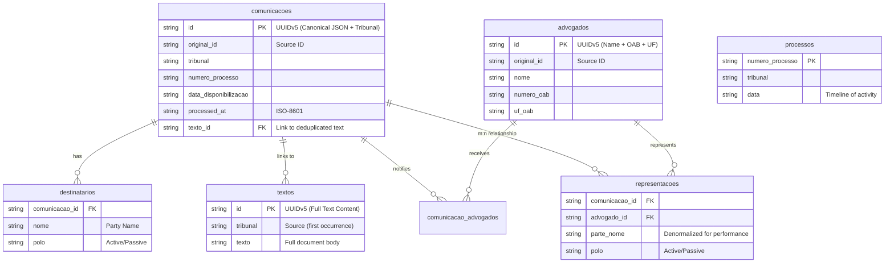

# CausaGanha


**CausaGanha** is a judicial analytics platform that collects, archives, and analyzes data from the Brazilian DJEN (Diário de Justiça Eletrônico Nacional) to provide transparent lawyer performance ratings.

## [Live Dashboard](https://franklinbaldo.github.io/causaganha/)

## Why This Matters

### The Problem: Information Asymmetry

In Brazil's legal market, clients have no way to objectively evaluate lawyer performance before hiring. The information asymmetry is stark:

- **Lawyers know** their track record, specializations, and typical outcomes
- **Clients don't know** if a lawyer wins cases, how long cases take, or their expertise areas
- **Result**: Clients rely on referrals, advertising, or luck—not data

This asymmetry harms consumers and protects underperforming lawyers from market accountability.

### The Solution: Public Data, Made Accessible

DJEN (Diário de Justiça Eletrônico Nacional) publishes **every judicial communication** from all 91 Brazilian courts—thousands of documents daily. This data includes:

- Lawyer names and OAB (bar association) numbers
- Case outcomes: wins, losses, settlements
- Which parties lawyers represent
- Timeline of case progression

**This data is already public.** But it's scattered across 91 different court systems, published daily in formats designed for lawyers—not for analysis. No one has aggregated it to answer simple questions like "What is this lawyer's win rate?"

### Our Strategy: Archive Everything, Analyze Later

We're building a **complete historical archive** of DJEN data:

1. **Collect Daily**: Every 5 minutes, download judicial communications from all 91 courts
2. **Archive Permanently**: Upload to Internet Archive—free, permanent, public storage
3. **Convert to Analytics Format**: Transform raw data into Parquet (columnar, compressed, queryable)
4. **Build the Index**: Master catalog enables querying without downloading everything

**Why Internet Archive?**

- Free, unlimited storage
- Permanent URLs (data doesn't disappear)
- Public access (anyone can verify our data)
- Supports remote queries via HTTP range requests

**Why archive first, analyze later?**

- Data that isn't collected is lost forever
- Storage is cheap; re-collection is impossible
- Analysis methods improve; raw data doesn't
- Regulatory changes could restrict access

### Data Coverage

| Metric | Value |
| :----- | :---- |
| Courts monitored | 91 (all Brazilian jurisdictions) |
| Collection frequency | Every 5 minutes |
| Data format | JSON (raw) → Parquet (analytics) |
| Storage | Internet Archive (permanent) |
| Historical data | Building from 2024 onwards |

## Architecture

```text
┌─────────────────────────────────────────────────────────────────────────────┐

│                           CAUSAGANHA PIPELINE                               │
└─────────────────────────────────────────────────────────────────────────────┘

┌──────────────┐     ┌──────────────┐     ┌──────────────────────────────────┐
│   DJEN API   │────▶│  DJEN Proxy  │────▶│      GitHub Actions (5min)       │
│ (geo-blocked)│     │ (Cloud Run)  │     │  Download ZIP → Upload to IA     │
└──────────────┘     └──────────────┘     └──────────────────────────────────┘
                                                         │
                                                         ▼
### Internet Archive (Consolidated Data Lake)

Since January 2026, we have transitioned from per-tribunal files to **consolidated daily Parquet files** to optimize query performance and reduce file metadata overhead.

```text

djen-2026-01-27/
├── djen-2026-01-27-TJSP.zip   ← Raw source
├── djen-2026-01-27-TJRS.zip   ← Raw source
├── djen-2026-01-27-TJRS.absent ← Marker for empty journals
├── comunicacoes.parquet       ← Consolidated (all 91 courts)
├── advogados.parquet          ← Global identifiers (OAB+UF+Name)
├── representacoes.parquet     ← Materialized Lawyer-Party links
├── processos.parquet          ← Fast timeline index
├── textos.parquet             ← Content-addressed texts
└── ...

```

## Data Schema

The consolidated data lake follows a future-proofed schema using deterministic **UUIDv5** identifiers for both communications and lawyers, enabling national-level deduplication and stable cross-referencing.



## Data Pipeline

All data processing is handled by a single consolidated workflow (`.github/workflows/pipeline.yml`) that runs every 5 minutes with conditional job execution:

| Job | Frequency | Description |
| :-- | :-------- | :---------- |
| **Collect** | Every 5 min | Download from DJEN → Upload ZIP/Absent to IA |
| **Consolidate** | Every 10 min | Atomic consolidation (waits for 91 markers) |
| **Embed** | Hourly | Generate vector embeddings |
| **Catalog** | Daily | Update master catalog |

Each job calls a Python script that can be run locally:

```bash
# Run locally for testing/debugging
uv run python scripts/pipeline/collect.py --date 2026-01-27
uv run python scripts/pipeline/consolidate.py --date 2026-01-27
uv run python scripts/pipeline/embed.py --max-decisions 100
uv run python scripts/generate_catalog.py --upload
```

See the workflow file for detailed documentation on architecture and configuration.

## DJEN API

The DJEN (Diário de Justiça Eletrônico Nacional) provides structured judicial communication data:

- **Lawyers**: OAB numbers, names
- **Parties**: Process parties (plaintiff, defendant)
- **Communications**: Intimations, citations, notifications
- **Processes**: Case numbers, courts, dates

**API Documentation**: See [docs/DJEN_API.md](docs/DJEN_API.md)

### Geo-blocking

The DJEN API is geo-blocked to Brazilian IPs. We use a reverse proxy on Google Cloud Run (São Paulo region) to bypass this restriction.

**Proxy URL**: `https://djen-proxy-mhgmawcn3a-rj.a.run.app`

See [docs/DJEN_PROXY.md](docs/DJEN_PROXY.md) for details.

## Quick Start

```bash
# Install dependencies
uv sync

# Initialize local database
causaganha db init

# Check database status
causaganha db status

# Download and analyze from Internet Archive
causaganha parquet download TJRO 2026-01-15
causaganha parquet analyze TJRO 2026-01-15
```

## Catalog System

The master catalog provides an index of all DJEN data on Internet Archive:

```bash
# Download catalog (< 10 MB)
causaganha catalog download

# Check what data is missing
causaganha catalog backfill-status

# Query the catalog
causaganha catalog query "SELECT * FROM manifest WHERE tribunal = 'TJSP' LIMIT 10"
```

Query remote data directly (no download needed):

```sql
-- Open catalog in DuckDB
duckdb causaganha-catalog/catalog.duckdb

-- Query remote Parquet files on Internet Archive
SELECT tribunal, COUNT(*) FROM comunicacoes GROUP BY tribunal;
```

See [docs/CATALOG.md](docs/CATALOG.md) for detailed documentation.

## Project Structure

```text
causaganha/

├── src/causaganha/          # Main Python package
│   ├── cli/                 # Typer CLI commands
│   ├── pipeline/            # Data pipeline (collect, analyze, score)
│   ├── analysis/            # AI analysis (LLM, RAG, embeddings)
│   ├── storage/             # DuckDB + Parquet storage
│   ├── scoring/             # OpenSkill rating algorithm
│   ├── catalog/             # DuckDB catalog generator
│   └── clients/             # External service clients
├── djen-scraper/            # DJEN scraping infrastructure
│   ├── dashboard/           # Status dashboard (React)
│   └── scripts/             # Conversion scripts
├── .github/workflows/       # GitHub Actions pipelines
├── docs/                    # Documentation
└── tests/                   # BDD and unit tests
```

## Internet Archive Structure

All data is publicly archived on Internet Archive:

| Item Pattern | Contents |
| :----------- | :------- |
| `djen-YYYY-MM-DD` | ZIPs, Parquets, and .absent markers for one day |
| `causaganha-catalog` | Master DuckDB catalog + manifest |
| `causaganha-embeddings-*` | Embedding vectors for semantic search |

## Development

```bash
# Setup
uv venv && source .venv/bin/activate
uv sync --dev

# Run tests
uv run pytest

# Run linter
uv run ruff check --fix

# See all CLI commands
causaganha --help
```

For detailed developer guidance, see [CLAUDE.md](CLAUDE.md).

## License

MIT
