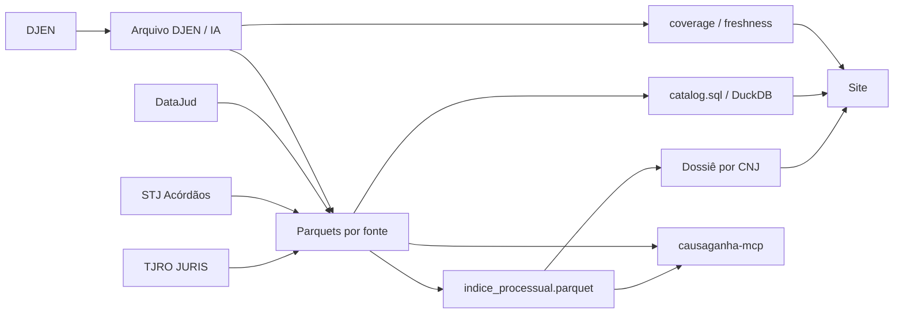

# CausaGanha


**CausaGanha é uma camada pública e verificável para acompanhar o rastro de processos judiciais brasileiros.** O projeto preserva o que foi publicado, reconcilia fontes oficiais e mantém explícito de onde veio cada fato — inclusive quando uma fonte não tem aquele processo, está indisponível ou representa apenas um snapshot no tempo.

O site permite consultar um processo por número CNJ, pesquisar publicações por texto/OAB/parte e explorar a cobertura do arquivo. Os mesmos dados também podem ser reutilizados diretamente via Internet Archive + DuckDB ou consultados por assistentes através do servidor MCP read-only.

**Site público:** [franklinbaldo.github.io/causaganha](https://franklinbaldo.github.io/causaganha/)

## O produto em três perguntas

Um processo deixa rastros diferentes em fontes diferentes. O CausaGanha evita fundi-los numa resposta opaca:

| Pergunta | Evidência | Papel no CausaGanha |
|---|---|---|
| **O que foi publicado e preservado?** | arquivo | DJEN preservado no Internet Archive, Parquets e catálogo reproduzível |
| **Onde o processo está / o que aconteceu na linha processual?** | estado | metadata e movimentação processual, especialmente DataJud |
| **O que a decisão ou documento efetivamente diz?** | teor | documentos de jurisprudência e acórdãos quando a fonte correspondente está disponível |

Arquivo, estado e teor podem divergir no tempo. Um documento local antigo não prova que o processo parou; um movimento chamado “Sentença” não prova qual foi o fundamento da sentença. A proveniência continua visível para que o consumidor saiba exatamente o que cada fonte sustenta.

## Quatro fontes, quatro papéis

O knowledge corpus do projeto modela quatro fontes oficiais e os pipelines que as consomem:

| Fonte | O que ela traz | Papel principal |
|---|---|---|
| **DJEN (CNJ)** | comunicações judiciais diárias | preservação, busca de publicações, cobertura histórica |
| **TJRO JURIS** | decisões e documentos de jurisprudência do TJRO | teor estruturado e corpus de decisões |
| **STJ Acórdãos** | acórdãos do Superior Tribunal de Justiça | teor/metadata de decisões do STJ e reconciliação processual |
| **DataJud (CNJ)** | capa, classe, assuntos, órgão, grau, datas e movimentos | estado processual, enriquecimento e facetas |

A existência de um pipeline **não implica cobertura completa nem maturidade operacional idêntica**. Cada superfície deve expor freshness, cobertura e limitações de sua própria fonte em vez de transformar integração em promessa de completude.

## Três interfaces do mesmo sistema

### 1. Site

A home aceita dois jobs principais:

- um **CNJ** leva ao dossiê reconciliado em `/processo`;
- texto livre, OAB ou parte leva à busca de publicações do DJEN.

O dossiê por CNJ usa `indice_processual.parquet` como índice fino: ele descobre quais fontes têm registro para o processo e consulta os Parquets de origem sem copiar todo o conteúdo para uma tabela monolítica.

### 2. Dados públicos

O produto suportado continua tendo como fundação o **arquivo público**. ZIPs originais, manifestos e derivados ficam no Internet Archive. O catálogo público é distribuído como SQL auditável, não como um banco DuckDB opaco:

```bash
curl -L https://archive.org/download/causaganha-catalog/catalog.sql -o catalog.sql
duckdb causaganha.duckdb < catalog.sql
duckdb causaganha.duckdb "SELECT * FROM comunicacoes LIMIT 100;"
```

Artefatos centrais:

- `sync-manifest.parquet` — fonte de verdade da sincronização DJEN;
- `catalog.sql` — contrato reconstruível das views públicas;
- `indice_processual.parquet` — índice fino que liga CNJs às fontes/arquivos de origem;
- Parquets específicos de DJEN, JURIS, STJ e DataJud conforme disponibilidade de cada pipeline.

### 3. Agentes / MCP

`causaganha-mcp` expõe uma superfície read-only para assistentes. Hoje são **sete tools**:

- `causaganha_status`
- `djen_backup_status`
- `tjro_juris_status`
- `stj_acordaos_status`
- `datajud_status`
- `datajud_facetas`
- `processo_consultar`

As cinco tools de status leem estado local dos pipelines. `datajud_facetas` consulta a API pública do DataJud; `processo_consultar` lê o índice e os Parquets canônicos publicados no Internet Archive. Nenhuma tool dispara ingestão, upload ou backfill.

Hosts que suportam MCP local por stdio podem iniciar o servidor com:

```json
{
  "mcpServers": {
    "causaganha": {
      "command": "uv",
      "args": ["run", "--directory", "/caminho/para/causaganha", "causaganha-mcp"]
    }
  }
}
```

Servir o MCP remotamente para hosts que exigem HTTP não está configurado neste repositório.

## Fundação: o arquivo DJEN

O DJEN (Diário de Justiça Eletrônico Nacional) publica comunicações judiciais com efeitos jurídicos e existência frequentemente efêmera na superfície de origem. O CausaGanha preserva os ZIPs no Internet Archive e mantém um manifesto auditável por par `(tribunal, data)`.

O motor canônico fica em `src/djen_backup/` e opera com pools independentes de check, download e upload. O estado é um log append-only de segmentos compactados em `sync-manifest.parquet`; o projeto não trata um código HTTP isolado como veredito de disponibilidade.

### Invariantes importantes

- `403` do DJEN **não significa ausência**; pode ser bloqueio/rate-limit e deve continuar desconhecido/retriável.
- `200` também **não basta para dizer disponível**: o DJEN pode responder `{"status": "Sem comunicações"}` sem URL de download.
- o arquivo distingue ausência confirmada de erro transitório, nunca verificado e pendência real.
- uploads do Internet Archive usam `httpx` e headers `x-archive-meta-*`; não `boto3`.

### Workflows principais

| Workflow | Trigger | Papel |
|---|---|---|
| `collect-zips.yml` | a cada 20 min | consultar DJEN, baixar e arquivar ZIPs |
| `upload-backlog.yml` | a cada 15 min | drenar ZIPs já confirmados |
| `render-manifest-parquet.yml` | a cada 30 min | compactar o event log no manifesto base |
| `consolidate-parquet.yml` | diário | ZIPs → Parquet |
| `update-catalog.yml` | após consolidação | atualizar catálogo/índice e contratos derivados |
| `deploy-web.yml` | push / catálogo | renderizar dados e publicar o site |
| `canary.yml` | diário | provar o caminho DJEN/deploy contra o sistema real |

## Arquitetura



Há duas superfícies de runtime principais:

- backend Python/CLIs em `src/`;
- frontend Astro + Svelte em `web/`.

Metadados estáveis de produto (fontes e pipelines) vivem no bundle OKF de `knowledge/`; contratos físicos continuam no código, Parquet e Zod. O OKF participa do `causaganha_status`, mas não substitui schema registry nem contratos de dados.

## CLIs

Entry points registrados em `pyproject.toml`:

| Comando | Papel |
|---|---|
| `djen-backup` | sincronização/arquivo DJEN |
| `tjro-juris` | coleta de jurisprudência TJRO |
| `stj-acordaos` | coleta de acórdãos STJ |
| `datajud` | enriquecimento processual DataJud |
| `causaganha-mcp` | servidor MCP read-only |

Exemplos:

```bash
uv run djen-backup --workers 8
uv run djen-backup check --workers 8
uv run djen-backup upload --workers 4
uv run --env-file .env datajud enrich --tribunal tjro --skip-upload
```

A consolidação Parquet é um module CLI: `python -m causaganha.consolidate`.

## Frontend e contratos de consulta

O frontend usa Astro 5, Svelte 5, DuckDB WASM, Vitest e Zod.

As necessidades de dados do site são declaradas em `web/src/queries/*.qmd`. Cada contrato define output/formato e uma consulta SQL. `scripts/render_queries.py` materializa JSON em `web/public/data/`, e os payloads renderizados são validados contra o registry Zod do frontend em CI.

Para adicionar uma view:

1. criar `web/src/queries/minha_view.qmd`;
2. adicionar o schema/registry em `web/src/lib/data/contracts.ts`;
3. executar `uv run python scripts/render_queries.py`.

Veja `web/src/queries/README.md` para o contrato completo.

## Lab experimental

Classificação de resultados, embeddings, segmentação de decisões, treinamento de modelos e outros experimentos ficam sob a fronteira **Lab**. Eles podem usar o arquivo público como matéria-prima, mas **não definem a confiabilidade do produto suportado** e não devem ser apresentados como fatos equivalentes aos registros oficiais.

Notebooks são autorados em marimo (`notebooks/*.py`) e exportados para `.ipynb` em CI. A governança da camada analítica está em `docs/GOVERNANCE.md`.

## Desenvolvimento

Pré-requisitos: Python 3.12+, [`uv`](https://docs.astral.sh/uv/) e Node.js 22+.

```bash
uv sync --dev
cp .env.example .env
uv run pre-commit install
uv run pytest -q
```

Gates usuais:

```bash
uv run ruff format --check
uv run ruff check
uvx vulture src/ scripts/ vulture_whitelist.py --min-confidence 100
cd web && npm ci && npm run lint && npm test && npm run build
```

## Estrutura do repositório

```text
knowledge/               fatos estáveis de fontes/pipelines (OKF)
src/causaganha/          domínio, consolidação e processo como recurso
src/causaganha_mcp/      superfície MCP
src/djen_backup/         motor de sincronização DJEN
src/datajud/              client/service/archive DataJud
src/tjro_juris/           pipeline JURIS
src/stj_acordaos/         pipeline STJ
web/                     site Astro + Svelte
scripts/                 pipelines e operações auxiliares
notebooks/               Lab / marimo + exports
.github/workflows/       CI/CD e jobs de dados
```

## Documentação

- [`docs/PRODUCT.md`](docs/PRODUCT.md) — modelo de produto, proveniência e fronteiras
- [`CONTRIBUTING.md`](CONTRIBUTING.md) — setup e regras de contribuição
- [`FRONTEND.md`](FRONTEND.md) — arquitetura/design do frontend
- [`web/src/queries/README.md`](web/src/queries/README.md) — contratos `.qmd`
- [`docs/GOVERNANCE.md`](docs/GOVERNANCE.md) — preservação, correção/restrição e licenciamento
- [`docs/SERVICE_OBJECTIVES.md`](docs/SERVICE_OBJECTIVES.md) — objetivos operacionais e canário

Se documentação e código divergirem, o código/workflow é a evidência operacional e a documentação deve ser corrigida na mesma mudança.

## Licença

- **Código:** [MIT](LICENSE).
- **Dados derivados pelo projeto:** direitos que pertençam ao CausaGanha são disponibilizados sob [CC0 1.0](https://creativecommons.org/publicdomain/zero/1.0/).

Textos de atos oficiais têm regime próprio (Lei 9.610/98, art. 8º, IV), sem prejuízo de direitos de terceiros eventualmente reproduzidos, privacidade ou proteção de dados. A política completa de preservação, correção e restrição está em [`docs/GOVERNANCE.md`](docs/GOVERNANCE.md).