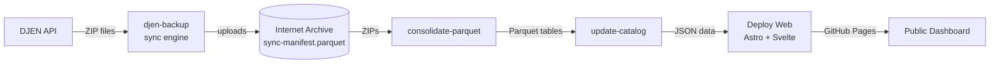

# CausaGanha


CausaGanha is a judicial data platform focused on the Brazilian DJEN ecosystem. The project collects judicial communications, archives raw ZIPs on Internet Archive, consolidates them into analytics-friendly Parquet datasets, and serves a public dashboard with coverage and publication views.

DJEN (Diário de Justiça Eletrônico Nacional) is the official electronic gazette for Brazilian courts. It publishes daily judicial communications — summons, rulings, and process updates — that have legal weight. CausaGanha preserves these ephemeral publications on Internet Archive so they remain accessible even after court portals go offline or restrict access.

Live dashboard: [https://franklinbaldo.github.io/causaganha/](https://franklinbaldo.github.io/causaganha/)

## What the project does

The supported product is the **archive**:

- Collects DJEN ZIPs continuously and archives them on Internet Archive.
- Consolidates daily raw data into structured Parquet tables.
- Maintains a catalog and dashboard cache for public browsing.
- Ships an Astro + Svelte frontend for public exploration.

Experimental analysis — case-outcome classification, per-lawyer indicators, embeddings, and model training — lives under the **Lab** boundary (`scripts/` experiments and the `lab` dependency group). It is derived from the archived public record and is not part of the core runtime. See [docs/GOVERNANCE.md](docs/GOVERNANCE.md) §4 for how the analytical layer is governed.

## Current architecture

The repository has two main runtime surfaces:

- Python backend and CLI in [src/causaganha](src/causaganha) and [src/djen_backup](src/djen_backup)
- Web frontend in [web](web)



1. **djen-backup** — manifest-driven sync engine. Tracks every `(tribunal, date)` pair via an append-only log of segments compacted into `sync-manifest.parquet` on Internet Archive. Workers check DJEN availability, download ZIPs, upload to IA, and record raw response codes (404, 400, 403, timeout, etc.) for accurate status tracking.
2. **Consolidate Parquet** — converts complete daily ZIP batches into Parquet tables.
3. **Update Catalog** — refreshes metadata used by downstream consumers.
4. **Deploy Web** — renders query contracts (`.qmd` files in `web/src/queries/`) to JSON and publishes the Astro site to GitHub Pages.

### Sync manifest

The source of truth for what's been archived is `sync-manifest.parquet` at `https://archive.org/download/causaganha-dashboard/sync-manifest.parquet`. It is the compacted base of an append-only event log (`manifest-log/*.csv` segments written by the engine/drain/probe, absorbed every 30 min by `scripts/render_manifest_parquet.py`). Each row:

```csv
tribunal,date,ia_status,djen_status,djen_raw,updated_at
TJSP,2025-01-15,uploaded,,200,2026-04-14T10:00:00
TJSP,2025-01-16,,absent,404,2026-04-14T10:01:00
```

The engine periodically (every 10 min) uploads a segment of the mutated rows and a compact `manifest-summary.json` to IA, so progress is never lost to crashes. The legacy `sync-manifest.csv` is retired as a source of truth; it can still be produced as a derived export on demand (`MANIFEST_COMPACT_WRITEBACK=1` when running the compactor) for tooling that hasn't migrated.

### GitHub Actions workflows

| Workflow | Trigger | Purpose |
|---|---|---|
| [collect-zips.yml](.github/workflows/collect-zips.yml) | Every 20 min | Check DJEN + download + upload to IA |
| [upload-backlog.yml](.github/workflows/upload-backlog.yml) | Every 15 min | Drain confirmed-available ZIPs (no DJEN checks) |
| [render-manifest-parquet.yml](.github/workflows/render-manifest-parquet.yml) | Every 30 min | Compact manifest-log segments into the sync-manifest.parquet base |
| [consolidate-parquet.yml](.github/workflows/consolidate-parquet.yml) | Daily 07:00 UTC | Convert ZIPs → Parquet |
| [update-catalog.yml](.github/workflows/update-catalog.yml) | After consolidate | Refresh catalog metadata |
| [deploy-web.yml](.github/workflows/deploy-web.yml) | Push to `main` (`web/`) + after catalog | Build + deploy dashboard |
| [drain-unknowns.yml](.github/workflows/drain-unknowns.yml) | Manual | Re-check `unknown` rows, push manifest to IA |
| [backfill-probe.yml](.github/workflows/backfill-probe.yml) | Manual / push | Probe DJEN proxy + manifest drift |
| [recover-manifest.yml](.github/workflows/recover-manifest.yml) | Manual | Restore the manifest from cache/artifact |
| [canary.yml](.github/workflows/canary.yml) | Daily 10:00 UTC | End-to-end check against the real deployed system (see [docs/SERVICE_OBJECTIVES.md](docs/SERVICE_OBJECTIVES.md)) |
| [test.yml](.github/workflows/test.yml) | PR / push | Lint, notebook sync, test, build |

## Gotchas

- **Internet Archive uploads must use `httpx`, not `boto3`.** IA's S3-compatible endpoint expects `x-archive-meta-*` headers; `boto3` sends `x-amz-meta-*` and the metadata is silently dropped.
- **403 from DJEN ≠ absent.** CloudFront returns 403 when rate-limiting. Only `404` (plus `400` for holidays) is a genuine absence; `403`/`5xx`/`timeout` must be treated as unknown and retried.

## Quick start

Prerequisites: Python 3.12+, [`uv`](https://docs.astral.sh/uv/), Node.js 22+

```bash
uv sync --dev
cp .env.example .env
uv run pre-commit install
uv run pytest -q
```

## Python CLIs

Registered entry points (`pyproject.toml` `[project.scripts]`):

| Command | Purpose |
|---|---|
| `djen-backup` | DJEN sync engine (check + download + upload to IA) |
| `stj-acordaos` | STJ acórdãos collection |
| `tjro-juris` | TJRO jurisprudence collection |
| `datajud` | DataJud process metadata enrichment |
| `causaganha-mcp` | MCP server exposing read-only status tools to AI assistants (see [below](#use-o-causaganha-no-seu-assistente)) |

### `djen-backup` — sync engine

```bash
# Full sync (check DJEN + download + upload to IA)
uv run djen-backup --workers 8

# Only verify DJEN availability, no downloads
uv run djen-backup check --workers 8

# Only download+upload entries already marked available
uv run djen-backup upload --workers 4
```

Subcommand modes:

| Mode    | Checkers | Downloaders | Uploaders |
|---------|----------|-------------|-----------|
| default | ✓        | ✓           | ✓         |
| check   | ✓        | ✗           | ✗         |
| upload  | ✗        | ✓           | ✓         |

All modes persist the manifest to IA every 10 minutes. See `uv run djen-backup --help`.

Parquet consolidation is a module CLI (`python -m causaganha.consolidate`), not a registered console script.


### `datajud` — CNJ process metadata enrichment

The `datajud` CLI uses the configured public key default in `src/causaganha/config.py`; set `DATAJUD_API_KEY` in local, production, or CI environments when you need to override/rotate it without a deploy. Obtain the current public key from the CNJ DataJud access page: https://datajud-wiki.cnj.jus.br/api-publica/acesso/ or from the committed rotation log in `docs/datajud-api-keys.md`.

When the CNJ rotates the key (usually visible as HTTP 401 responses), add the new public key to `docs/datajud-api-keys.md`, update local `.env` files, and rotate the CI/production secret named `DATAJUD_API_KEY`; no code change is needed. The production default lives in `src/causaganha/config.py`; the environment variable takes precedence for emergency rotation.

```bash
# Example local run with .env populated from .env.example
uv run --env-file .env datajud enrich --tribunal tjro --skip-upload
```

## Use o CausaGanha no seu assistente

Além da CLI e do dashboard web, o CausaGanha expõe um servidor [MCP](https://modelcontextprotocol.io/) (`causaganha-mcp`) — um conjunto de tools que um assistente de IA pode chamar diretamente, sem passar por um shell.

`causaganha-mcp` roda por padrão como um processo local sobre stdio. Isso funciona em hosts com suporte a stdio local, como o Claude Desktop — configure em `claude_desktop_config.json` (ou equivalente):

```json
{
  "mcpServers": {
    "causaganha": {
      "command": "uv",
      "args": ["run", "--directory", "/caminho/para/causaganha", "causaganha-mcp"]
    }
  }
}
```

**ChatGPT não usa essa receita.** O modo Developer/conectores MCP do ChatGPT exige um endpoint remoto (ou o Secure MCP Tunnel) — não conecta a um processo `stdio` local como o acima, e depende de plano/modo específicos. Ver a [documentação oficial](https://help.openai.com/pt-br/articles/12584461-developer-mode-and-full-mcp-connectors-in-chatgpt-beta). Servir `causaganha-mcp` remotamente para ChatGPT (ou outro host que só fale HTTP) ainda não está configurado neste repositório.

Seis tools hoje, em dois grupos:

- **Locais, sem chamada de rede** — leem só o manifest de cada pipeline neste disco: `causaganha_status` (panorama dos quatro pipelines numa só chamada), `datajud_status`, `tjro_juris_status`, `stj_acordaos_status`, `djen_backup_status` (o mesmo detalhe de `causaganha_status`, mas por pipeline).
- **Consulta ao vivo** — `datajud_facetas` é a única que sai da máquina: consulta a API pública do DataJud em tempo real.

Nenhuma delas dispara ingestão, upload ou backfill — para isso, use a CLI ou os workflows agendados (ver acima).

Perguntas que dá pra fazer direto pro assistente, sem abrir terminal:

- "Como estão os pipelines?"
- "Há uploads pendentes?"
- "Quais são as principais classes do TJRO?"
- "Quais assuntos aparecem mais no acervo do TJRO?"
- "Os dados locais podem estar desatualizados?"

## Web frontend

The frontend lives in [web](web) and uses:

- Astro 5
- Svelte 5
- DuckDB WASM
- Vitest
- ESLint
- Zod

### Query contracts

The frontend declares its data needs via Quarto-compatible `.qmd` files in [web/src/queries/](web/src/queries/). Each file has YAML frontmatter (output path + format) plus a SQL code block that runs against the manifest. The backend executes these during deploy and publishes JSON to `web/public/data/`.

To add a new view:

1. Create `web/src/queries/my_view.qmd` with frontmatter and a SQL block
2. Add a Zod schema + registry entry in [web/src/lib/data/contracts.ts](web/src/lib/data/contracts.ts) (pages load it via `loadContract('my_view')`)
3. `uv run python scripts/render_queries.py` generates the JSON

See [web/src/queries/README.md](web/src/queries/README.md) for the full contract.

Useful commands:

```bash
cd web
npm ci
npm run dev
npm run lint
npm test
npm run build
```

If you already use Bun locally, `bun install` and `bun run build` also work for development, but CI is currently based on `npm`.

## Notebooks

Notebooks are authored as [marimo](https://marimo.io) notebooks (`notebooks/*.py`,
the source of truth). The committed `.ipynb` is an export produced by
`marimo export ipynb` and kept in sync by CI
(`scripts/check_notebooks_synced.py`). Open the exported Jupyter notebooks
directly in Google Colab:

| Notebook | Open in Colab (`.ipynb`) | Open in marimo (`.py`) |
|---|---|---|
| **Decision segmenter v7** — fine-tune the 26-class anchor-span token classifier (OPF, BIOES) | [](https://colab.research.google.com/github/franklinbaldo/causaganha/blob/main/notebooks/train_segmenter_colab.ipynb) | [open](https://marimo.app/github.com/franklinbaldo/causaganha/blob/main/notebooks/train_decision_segmenter.py) |
| **ML document classifier** — train the outcome classifier on embeddings | [](https://colab.research.google.com/github/franklinbaldo/causaganha/blob/main/notebooks/train_ml_document_classifier.ipynb) | [open](https://marimo.app/github.com/franklinbaldo/causaganha/blob/main/notebooks/train_ml_document_classifier.py) |
| **Cost estimate** — estimate embedding token costs from the corpus | [](https://colab.research.google.com/github/franklinbaldo/causaganha/blob/main/notebooks/cost_estimate.ipynb) | [open](https://marimo.app/github.com/franklinbaldo/causaganha/blob/main/notebooks/cost_estimate.py) |

The **marimo** links open the `.py` source directly in the
[marimo](https://marimo.io) WASM playground (runs in-browser, straight from
GitHub); the **Colab** links open the exported `.ipynb`. To edit a notebook
locally run `uv run marimo edit notebooks/<name>.py`, then regenerate its
`.ipynb` with `uv run python scripts/check_notebooks_synced.py --fix`.

## Repository structure

```text
src/causaganha/          Python package
src/djen_backup/         ZIP/backfill collection utilities
web/                     Astro + Svelte frontend
scripts/                 Operational and pipeline scripts
notebooks/               marimo notebooks (*.py) + exported *.ipynb
tests/                   Pytest and pytest-bdd suites
.github/workflows/       CI/CD and data workflows
```

Important Python package areas:

- [src/causaganha/consolidate](src/causaganha/consolidate) — ZIP → Parquet consolidation CLI (`python -m causaganha.consolidate`)
- [src/causaganha/storage](src/causaganha/storage) — schema and DuckDB connection
- [src/causaganha/pipeline](src/causaganha/pipeline) — IA S3 upload helpers
- [src/causaganha/analysis](src/causaganha/analysis) — experimental analysis (Lab)

## Development commands

Common local commands:

```bash
uv run pytest -q
uv run ruff format --check
uv run ruff check
uv run vulture src/ scripts/ vulture_whitelist.py --min-confidence 100
cd web && npm ci && npm run lint && npm test && npm run build
```

## Environment

Start from [.env.example](.env.example). Common variables include:

- `GEMINI_API_KEY` — LLM analysis (Lab; `src/causaganha/analysis`)
- `JINA_API_KEY` — API embeddings (Jina provider)
- `EMBEDDING_PROVIDER` / `EMBEDDING_PROVIDER_PRIORITY`
- `IA_ACCESS_KEY` / `IA_SECRET_KEY`
- `DJEN_DIRECT_URL` / `DJEN_PROXY_URL` / `DJEN_USE_PROXY`
- `ENABLED_TRIBUNALS` / `DEFAULT_TRIBUNAL`
- `LOG_LEVEL` / `LOG_FORMAT`

## Testing and CI

The main CI workflow is [test.yml](.github/workflows/test.yml). It currently runs:

1. Python formatting and blocking Ruff lint checks (`uv run ruff check`; legacy exceptions are tracked as targeted per-file ignores in `ruff.toml`)
2. Dead code check with `vulture`
3. Notebook sync check (`scripts/check_notebooks_synced.py`)
4. Python tests
5. Frontend lint, test, and build

Normal CI always uses read-only repository permissions. The separate
[trusted bot auto-fix workflow](.github/workflows/trusted-bot-autofix.yml) is
the only workflow that can push formatting fixes. Its allowlist currently
contains only `dependabot[bot]`; a pull request must also originate from a
branch in this repository (forks are never eligible). Add another bot only by
updating the workflow condition and its event-condition fixture together.

## Documentation

- [CONTRIBUTING.md](CONTRIBUTING.md) — setup, rules, PR checklist
- [FRONTEND.md](FRONTEND.md) — frontend design system and architecture
- [web/src/queries/README.md](web/src/queries/README.md) — query contract spec
- [docs/GOVERNANCE.md](docs/GOVERNANCE.md) — data governance: preservation-first policy, objective correction/restriction criteria, retention, indexing, dataset licensing
- [docs/SERVICE_OBJECTIVES.md](docs/SERVICE_OBJECTIVES.md) — operational SLOs (freshness, sanity, live DJEN check) and how the daily canary verifies them

If a doc disagrees with code or workflow files, trust the code and update the doc in the same change.

## License

- **Code:** [MIT](LICENSE).
- **Data:** the texts of judicial decisions and other official acts are not subject to copyright under Brazilian law (Lei 9.610/98, art. 8º, IV); this statement does not automatically extend to third-party works reproduced inside publications, nor does it affect privacy or data-protection rights. Whatever rights the project itself holds over its derived datasets and metadata (consolidated Parquet, sync manifest, dashboard aggregates) are released under [CC0 1.0](https://creativecommons.org/publicdomain/zero/1.0/).

See [docs/GOVERNANCE.md](docs/GOVERNANCE.md) for the full data-governance policy — preservation by default, with correction or restriction only on objective grounds: a processing error introduced by the project, or a determination from a competent authority. Later changes at the official source are recorded as provenance, not treated as grounds for removal.
