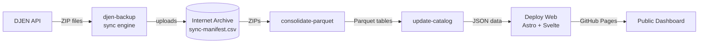

# CausaGanha


CausaGanha is a judicial data platform focused on the Brazilian DJEN ecosystem. The project collects judicial communications, archives raw ZIPs on Internet Archive, consolidates them into analytics-friendly Parquet datasets, and serves a public dashboard with coverage and publication views.

DJEN (Diário de Justiça Eletrônico Nacional) is the official electronic gazette for Brazilian courts. It publishes daily judicial communications — summons, rulings, and process updates — that have legal weight. CausaGanha preserves these ephemeral publications on Internet Archive so they remain accessible even after court portals go offline or restrict access.

Live dashboard: [https://franklinbaldo.github.io/causaganha/](https://franklinbaldo.github.io/causaganha/)

## What the project does

- Collects DJEN ZIPs continuously and archives them on Internet Archive.
- Consolidates daily raw data into structured Parquet tables.
- Maintains a catalog and dashboard cache for public browsing.
- Includes Python workflows for collection, analysis, scoring, archival, and backfill.
- Ships an Astro + Svelte frontend for public exploration.

## Current architecture

The repository has two main runtime surfaces:

- Python backend and CLI in [src/causaganha](src/causaganha) and [src/djen_backup](src/djen_backup)
- Web frontend in [web](web)



1. **djen-backup** — manifest-driven sync engine. Tracks every `(tribunal, date)` pair in a single CSV (`sync-manifest.csv`) stored on Internet Archive. Workers check DJEN availability, download ZIPs, upload to IA, and record raw response codes (404, 400, 403, timeout, etc.) for accurate status tracking.
2. **Consolidate Parquet** — converts complete daily ZIP batches into Parquet tables.
3. **Update Catalog** — refreshes metadata used by downstream consumers.
4. **Deploy Web** — renders query contracts (`.qmd` files in `web/src/queries/`) to JSON and publishes the Astro site to GitHub Pages.

### Sync manifest

The source of truth for what's been archived is `sync-manifest.csv` at `https://archive.org/download/causaganha-dashboard/sync-manifest.csv`. Each row:

```csv
tribunal,date,ia_status,djen_status,djen_raw,updated_at
TJSP,2025-01-15,uploaded,,200,2026-04-14T10:00:00
TJSP,2025-01-16,,absent,404,2026-04-14T10:01:00
```

The engine periodically (every 10 min) uploads the manifest and a compact `manifest-summary.json` to IA, so progress is never lost to crashes.

### GitHub Actions workflows

| Workflow | Trigger | Purpose |
|---|---|---|
| [collect-zips.yml](.github/workflows/collect-zips.yml) | Every 20 min | Check DJEN + download + upload to IA |
| [upload-backlog.yml](.github/workflows/upload-backlog.yml) | Every 15 min | Drain confirmed-available ZIPs (no DJEN checks) |
| [collect-today.yml](.github/workflows/collect-today.yml) | Daily 06:00 UTC | Today's publications |
| [consolidate-parquet.yml](.github/workflows/consolidate-parquet.yml) | Daily 07:00 UTC | Convert ZIPs → Parquet |
| [update-catalog.yml](.github/workflows/update-catalog.yml) | After consolidate | Refresh catalog metadata |
| [deploy-web.yml](.github/workflows/deploy-web.yml) | Push to `web/` | Build + deploy dashboard |
| [test.yml](.github/workflows/test.yml) | PR / push | Lint, test, build |

## Gotchas

- **Internet Archive uploads must use `httpx`, not `boto3`.** IA's S3-compatible endpoint expects `x-archive-meta-*` headers; `boto3` sends `x-amz-meta-*` and the metadata is silently dropped.
- **403 from DJEN ≠ absent.** CloudFront returns 403 when rate-limiting. Only `404` (plus `400` for holidays) is a genuine absence; `403`/`5xx`/`timeout` must be treated as unknown and retried.

## Quick start

Prerequisites: Python 3.12+, [`uv`](https://docs.astral.sh/uv/), Node.js 20+

```bash
uv sync --dev
cp .env.example .env
uv run pre-commit install
uv run pytest -q
```

## Python CLIs

Two CLI entrypoints:

### `djen-backup` — sync engine

```bash
# Full sync (check DJEN + download + upload to IA)
uv run djen-backup --workers 8

# Only verify DJEN availability, no downloads
uv run djen-backup check --workers 8

# Only download+upload entries already marked available
uv run djen-backup upload --workers 4
```

Subcommand modes:

| Mode    | Checkers | Downloaders | Uploaders |
|---------|----------|-------------|-----------|
| default | ✓        | ✓           | ✓         |
| check   | ✓        | ✗           | ✗         |
| upload  | ✗        | ✓           | ✓         |

All modes persist the manifest to IA every 10 minutes. See `uv run djen-backup --help`.

### `causaganha` — data pipeline CLI

Available top-level commands include: `collect`, `analyze`, `score`, `db`, `export-parquet`, `backfill`, `archival`, `groundtruth`, `parquet`, `catalog`.

```bash
uv run causaganha --help
```

## Web frontend

The frontend lives in [web](web) and uses:

- Astro 5
- Svelte 5
- DuckDB WASM
- Vitest
- ESLint
- Zod

### Query contracts

The frontend declares its data needs via Quarto-compatible `.qmd` files in [web/src/queries/](web/src/queries/). Each file has YAML frontmatter (output path + format) plus a SQL code block that runs against the manifest. The backend executes these during deploy and publishes JSON to `web/public/data/`.

To add a new view:

1. Create `web/src/queries/my_view.qmd` with frontmatter and a SQL block
2. Add a typed loader in [web/src/lib/queryData.ts](web/src/lib/queryData.ts)
3. `uv run python scripts/render_queries.py` generates the JSON

See [web/src/queries/README.md](web/src/queries/README.md) for the full contract.

Useful commands:

```bash
cd web
npm ci
npm run dev
npm run lint
npm test
npm run build
```

If you already use Bun locally, `bun install` and `bun run build` also work for development, but CI is currently based on `npm`.

## Notebooks

Notebooks are authored as [marimo](https://marimo.io) notebooks (`notebooks/*.py`,
the source of truth). The committed `.ipynb` is an export produced by
`marimo export ipynb` and kept in sync by CI
(`scripts/check_notebooks_synced.py`). Open the exported Jupyter notebooks
directly in Google Colab:

| Notebook | Open in Colab |
|---|---|
| **Decision segmenter** — fine-tune the 22-class judicial token classifier | [](https://colab.research.google.com/github/franklinbaldo/causaganha/blob/main/notebooks/train_decision_segmenter.ipynb) |
| **ML document classifier** — train the outcome classifier on embeddings | [](https://colab.research.google.com/github/franklinbaldo/causaganha/blob/main/notebooks/train_ml_document_classifier.ipynb) |
| **Cost estimate** — estimate embedding token costs from the corpus | [](https://colab.research.google.com/github/franklinbaldo/causaganha/blob/main/notebooks/cost_estimate.ipynb) |

To edit a notebook locally run `uv run marimo edit notebooks/<name>.py`, then
regenerate its `.ipynb` with `uv run python scripts/check_notebooks_synced.py --fix`.

## Repository structure

```text
src/causaganha/          Python package
src/djen_backup/         ZIP/backfill collection utilities
web/                     Astro + Svelte frontend
scripts/                 Operational and pipeline scripts
tests/                   Pytest and pytest-bdd suites
.github/workflows/       CI/CD and data workflows
```

Important Python package areas:

- [src/causaganha/analysis](src/causaganha/analysis)
- [src/causaganha/archival](src/causaganha/archival)
- [src/causaganha/catalog](src/causaganha/catalog)
- [src/causaganha/clients](src/causaganha/clients)
- [src/causaganha/compliance](src/causaganha/compliance)
- [src/causaganha/pipeline](src/causaganha/pipeline)
- [src/causaganha/scoring](src/causaganha/scoring)
- [src/causaganha/storage](src/causaganha/storage)

## Development commands

Common local commands:

```bash
uv run pytest -q
uv run ruff format --check
uv run ruff check
uvx vulture src/ scripts/ vulture_whitelist.py --min-confidence 100
cd web && npm ci && npm run lint && npm test && npm run build
```

## Environment

Start from [.env.example](.env.example). Common variables include:

- `GEMINI_API_KEY`
- `IA_ACCESS_KEY` / `IA_SECRET_KEY`
- `IAS3_ACCESS_KEY` / `IAS3_SECRET_KEY`
- `DJEN_DIRECT_URL`
- `DJEN_PROXY_URL`
- `DJEN_USE_PROXY`
- `ENABLED_TRIBUNALS`
- `LOG_LEVEL`

## Testing and CI

The main CI workflow is [test.yml](.github/workflows/test.yml). It currently runs:

1. Python formatting and lint checks
2. Dead code check with `vulture`
3. Python tests
4. Frontend lint, test, and build

## Documentation

- [CONTRIBUTING.md](CONTRIBUTING.md) — setup, rules, PR checklist
- [FRONTEND.md](FRONTEND.md) — frontend design system and architecture
- [web/src/queries/README.md](web/src/queries/README.md) — query contract spec

If a doc disagrees with code or workflow files, trust the code and update the doc in the same change.

## License

MIT
