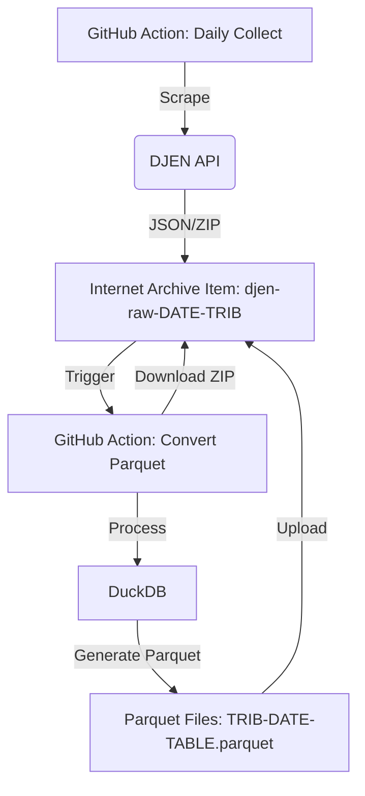

# DJEN Scraper

Scraper contínuo e gratuito para API DJEN (Diário de Justiça Eletrônico Nacional - PJe).

## 🎯 Características

- ✅ **Python & GitHub Actions** - Execução serverless e gratuita
- ✅ **Storage Internet Archive** - Arquivamento ilimitado e público
- ✅ **Parquet Otimizado** - Dados tabulares prontos para análise (DuckDB/Pandas)
- ✅ **Coleta Diária** - Agendada para 00:00 UTC

## 🏗️ Arquitetura (V2)



**Fluxo de Dados:**

1. **Coleta (`v2_daily_collect.yml`):** Baixa dados da API do DJEN e faz upload do ZIP bruto (`caderno.zip`) para um item no Internet Archive (`djen-raw-{DATE}-{TRIBUNAL}`).
2. **Conversão (`convert-parquet.yml`):** Monitora novos itens brutos, os baixa, converte para Parquet usando DuckDB e faz upload de volta para o *mesmo* item no Internet Archive.
3. **Análise:** O Dashboard e notebooks podem consumir os arquivos Parquet diretamente do Internet Archive via HTTP/Range requests.

No Internet Archive, cada dia/tribunal é um item:
**Item ID:** `djen-raw-2025-01-20-TJRO`

Arquivos contidos:

- 📦 `TJRO-2025-01-20.zip`: Dados brutos (JSON)
- 📊 `TJRO-2025-01-20-diarios.parquet`: Tabela principal
- 📊 `TJRO-2025-01-20-processos.parquet`: Metadados de processos
- 📊 `TJRO-2025-01-20-movimentos.parquet`: Movimentações

## 🚀 Workflows

### 1. Coleta Diária

- **Arquivo:** `.github/workflows/v2_daily_collect.yml`
- **Schedule:** 00:00 UTC
- **Comando:** `causaganha collect`

### 2. Conversão Parquet

- **Arquivo:** `.github/workflows/convert-parquet.yml`
- **Schedule:** A cada 30 min (processa pendências)
- **Script:** `djen-scraper/scripts/convert_to_parquet.py`

### 3. Dashboard

- **URL:** <https://franklinbaldo.github.io/causaganha/>
- **Código:** `djen-scraper/dashboard/`
- **Deploy:** Automático via GitHub Pages

## 🛠️ Desenvolvimento Local

### Pré-requisitos

- Python 3.12+
- `uv` (gerenciador de pacotes)

### Setup

```bash
# Instalar dependências
uv sync

# Ativar venv
source .venv/bin/activate
```

### Rodar Script de Conversão Manual

```bash
# Converter um item específico do IA
uv run python djen-scraper/scripts/convert_to_parquet.py batch.txt
# (Onde batch.txt contém o ID do item, ex: djen-raw-2025-01-20-TJRO)
```

## 📊 Dashboard Local

```bash
cd djen-scraper/dashboard
npm install
npm run dev
```

## 📝 Licença

MIT
