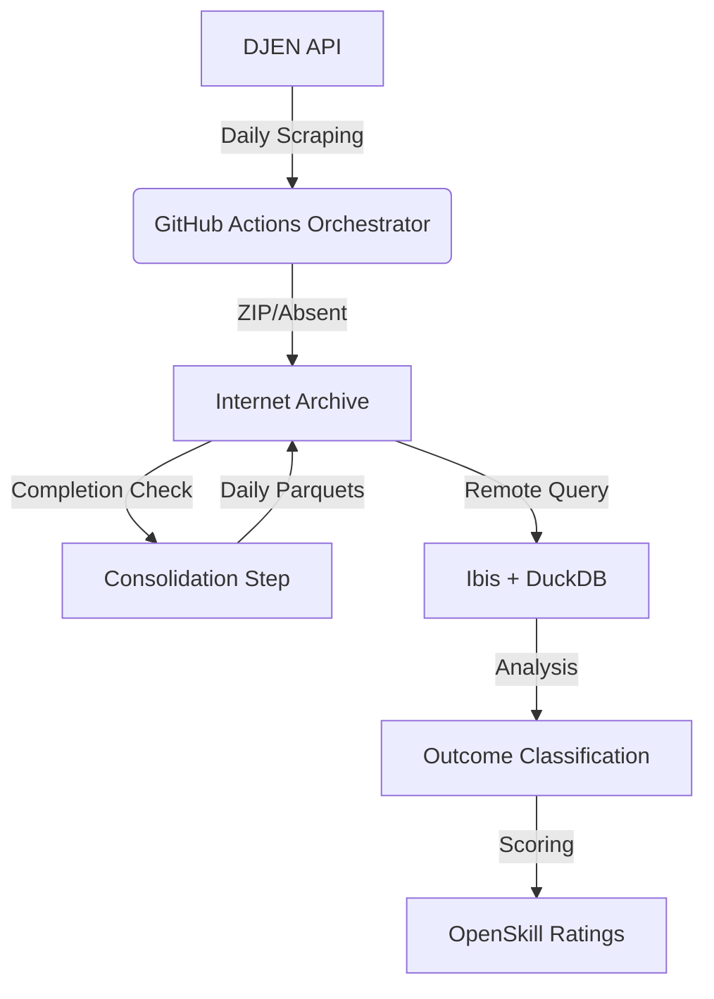

# System Architecture

CausaGanha has transitioned from an LLM-heavy "doc-reading" pipeline to a **structured data** ingestion and analysis engine powered by the DJEN (Diário de Justiça Eletrônico Nacional) API.

## 🏗️ High-Level Flow

### 1. Ingestion & Storage (Internet Archive)

The pipeline uses a **Single Orchestrator** running on **GitHub Actions** to query the DJEN API every 20 minutes.

- **Raw ZIPs**: Downloaded directly and uploaded to Internet Archive.
- **Absent Markers**: If a court has no journal for the day, an `.absent` file is uploaded to maintain a 91-item completion matrix.

### 2. Orchestration Strategy

All data processing is managed by `scripts/pipeline/run.py`. This script coordinates:
- **Parallel Tasks**: `collect`, `consolidate`, and `embed` run concurrently to maximize throughput while respecting independent date cohorts.
- **Sequential Steps**: `catalog` and `dashboard` updates trigger only after data changes.
- **Conservative Resource Management**: The `collect` step is configured to use **1 worker** for Internet Archive uploads to ensure maximum stability and compatibility with IA's S3-like API.

### 3. Atomic Consolidation

A dedicated consolidation step waits for all 91 courts to be present (ZIP or Absent) then merges them into **Atomic Daily Parquets**. This optimizes query performance by reducing metadata overhead and enabling national-level deduplication.

### 4. Data Layer (Ibis + DuckDB)

We use **Ibis** as a portable dataframe expression language, allowing us to query Parquet files directly on IA or locally via **DuckDB**. This eliminates the need for a traditional heavy database.

### 5. Analysis & Rating

- **Classification**: Heuristics and lightweight ML models classify communications into outcomes (Win/Loss/Other).
- **OpenSkill**: A Bayesian rating system (similar to Elo) calculates lawyer ratings based on these historical outcomes.

## 🛠️ Tech Stack

- **Lanuage**: Python 3.12 (uv for package management)
- **Data**: Ibis, DuckDB, Parquet
- **Infrastructure**: Cloudflare Workers, R2, Internet Archive
- **CLI**: Typer
- **DevTools**: Pytest (BDD), Structlog
