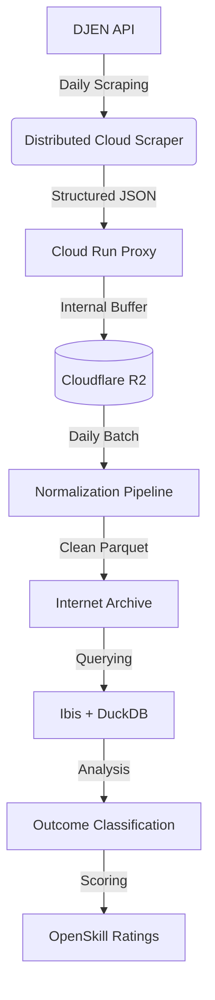

# System Architecture

CausaGanha has transitioned from an LLM-heavy "doc-reading" pipeline to a **structured data** ingestion and analysis engine powered by the DJEN (Diário de Justiça Eletrônico Nacional) API.

## 🏗️ High-Level Flow

## 🧩 Components

### 1. Ingestion (djen-scraper)

A distributed scraper (hosted on Cloudflare Workers/Cloud Run) that queries the DJEN API for daily judicial communications. It avoids IP blocking and ensures continuous data flow.

### 2. Storage & Buffer (R2 + IA)

- **R2**: Serves as a fast, transient buffer for raw JSON responses.
- **Internet Archive (IA)**: The primary long-term storage for normalized **Parquet** files. This keeps infrastructure costs near zero while maintaining public transparency.

### 3. Data Layer (Ibis + DuckDB)

We use **Ibis** as a portable dataframe expression language, allowing us to query Parquet files directly on IA or locally via **DuckDB**. This eliminates the need for a traditional heavy database.

### 4. Analysis & Rating

- **Classification**: Heuristics and lightweight ML models classify communications into outcomes (Win/Loss/Other).
- **OpenSkill**: A Bayesian rating system (similar to Elo) calculates lawyer ratings based on these historical outcomes.

## 🛠️ Tech Stack

- **Lanuage**: Python 3.12 (uv for package management)
- **Data**: Ibis, DuckDB, Parquet
- **Infrastructure**: Cloudflare Workers, R2, Internet Archive
- **CLI**: Typer
- **DevTools**: Pytest (BDD), Structlog
