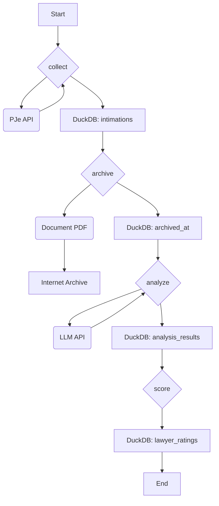

# Architecture

CausaGanha V2 is designed as a modular, pipeline-driven system. Each component has a distinct responsibility, making the system easier to maintain, test, and extend.

## Core Principles

-   **Dependency Injection**: Components like the database repository and API client are "injected" into the pipeline functions. This decouples the core logic from its dependencies, simplifying testing.
-   **Asynchronous Operations**: All I/O-bound tasks (API calls, database queries) are built on Python's `asyncio` to ensure high throughput.
-   **Clear Data Flow**: Data moves through a predictable sequence of steps, with each step enriching the data and persisting its state.

## System Layers

The system can be broken down into three main layers:

1.  **CLI (`cli.py`)**: The user-facing entry point. It parses commands and orchestrates the pipeline.
2.  **Pipeline (`pipeline/`)**: Contains the core logic for each step (`collect`, `archive`, `analyze`, `score`). It coordinates the interaction between services and the data layer.
3.  **Services & Storage**:
    -   **API Client (`api/`)**: Handles communication with the external PJe API.
    -   **Document Service (`services/`)**: Manages downloading and accessing PDF documents.
    -   **Archive Service (`services/`)**: Handles uploading to the Internet Archive (or local storage).
    -   **Analyzer (`analysis/`)**: Encapsulates the logic for using LLMs to extract data.
    -   **Repository (`storage/`)**: Abstracts all database operations using the Ibis framework.

## Data Flow Diagram

The following diagram illustrates how data moves through the CausaGanha pipeline from collection to scoring.

