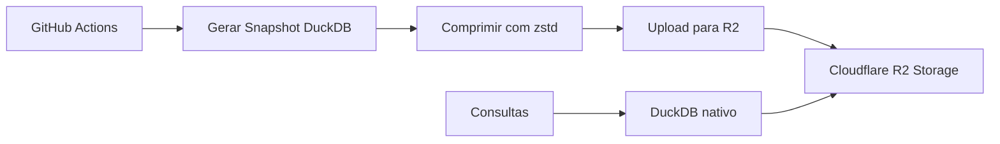

# Plano de Migração para Cloudflare R2 Storage

## Visão Geral

Este documento descreve o plano para implementar armazenamento de dados usando **Cloudflare R2** como alternativa 100% Cloudflare, sem dependência de AWS. O objetivo é armazenar snapshots DuckDB dos dados do CausaGanha de forma eficiente e econômica.

## Benefícios da Solução Cloudflare-Pura

- **Zero dependência AWS** - Não precisa instalar AWS CLI nem configurar credenciais AWS
- **Custo otimizado** - 10 GB gratuitos em R2, egress interno sem custo
- **Integração nativa** - DuckDB pode consultar R2 diretamente via protocolo S3
- **Simplicidade** - Ferramentas unificadas (Wrangler CLI)

## Arquitetura Proposta



## Implementação por Etapas

### Etapa 1: Configuração Inicial

| Ação | Comando | Objetivo |
|------|---------|----------|
| **Instalar Wrangler** | `npm i -g wrangler` | CLI oficial da Cloudflare |
| **Autenticar** | `wrangler login` | Configurar OAuth token |
| **Criar bucket** | `wrangler r2 bucket create causa-ganha` | Repositório de dados |

### Etapa 2: Estratégia de Upload

#### Para arquivos ≤ 315 MB (Recomendado)
```bash
wrangler r2 object put causa-ganha/snapshots/$(date +%Y%m%d).duckdb \
  --file=snapshot.duckdb.zst
```
**Vantagem**: Um comando simples, integração nativa

#### Para arquivos > 315 MB
```bash
# Opção A: rclone
rclone copy ./snapshot.duckdb r2:causa-ganha/snapshots/

# Opção B: minio client
mc cp snapshot.duckdb r2/causa-ganha/snapshots/
```
**Vantagem**: Suporte a uploads grandes via protocolo S3

### Etapa 3: Compressão e Otimização

```bash
# Gerar snapshot DuckDB
duckdb :memory: "
  COPY (SELECT * FROM ratings_view) TO 'snapshot.duckdb' (FORMAT DUCKDB);
"

# Comprimir (opcional, mas recomendado)
zstd -T0 snapshot.duckdb
```

**Estimativa de tamanho**:
- 150k decisões ≈ 50-100 MB raw
- Com zstd ≈ 15-30 MB comprimido
- **Resultado**: Dentro do limite de 315 MB do Wrangler

### Etapa 4: Consultas Diretas

```sql
-- DuckDB consulta diretamente no R2
duckdb "s3://causa-ganha/snapshots/20250625.duckdb" \
  --config "s3_region=''" \
  --config "s3_endpoint='https://<account-id>.r2.cloudflarestorage.com'"
```

## Automação CI/CD

### Script de Backup Diário

```bash
#!/bin/bash
# scripts/backup-to-r2.sh

set -e

# Gerar snapshot dos dados atuais
echo "Gerando snapshot DuckDB..."
python -c "
import duckdb
import pandas as pd
from datetime import datetime

# Carregar dados do CausaGanha
ratings_df = pd.read_csv('causaganha/data/ratings.csv')
partidas_df = pd.read_csv('causaganha/data/partidas.csv')

# Criar snapshot DuckDB
conn = duckdb.connect('snapshot.duckdb')
conn.execute('CREATE TABLE ratings AS SELECT * FROM ratings_df')
conn.execute('CREATE TABLE partidas AS SELECT * FROM partidas_df')
conn.close()
"

# Comprimir snapshot
echo "Comprimindo snapshot..."
zstd -T0 snapshot.duckdb

# Upload para R2
SNAPSHOT_NAME="causaganha-$(date +%Y%m%d).duckdb.zst"
echo "Uploading para R2: $SNAPSHOT_NAME"

wrangler r2 object put causa-ganha/snapshots/$SNAPSHOT_NAME \
  --file=snapshot.duckdb.zst

# Limpeza
rm snapshot.duckdb snapshot.duckdb.zst

echo "Backup concluído: $SNAPSHOT_NAME"
```

### GitHub Actions Workflow

```yaml
# .github/workflows/backup-r2.yml
name: Backup Daily to Cloudflare R2

on:
  schedule:
    - cron: '0 6 * * *'  # 6:00 UTC diário
  workflow_dispatch:

jobs:
  backup:
    runs-on: ubuntu-latest
    steps:
      - uses: actions/checkout@v4
      
      - name: Setup Node.js
        uses: actions/setup-node@v4
        with:
          node-version: '18'
          
      - name: Install Wrangler
        run: npm install -g wrangler
        
      - name: Setup Python
        uses: actions/setup-python@v4
        with:
          python-version: '3.12'
          
      - name: Install dependencies
        run: |
          pip install duckdb pandas zstd
          
      - name: Generate and upload snapshot
        env:
          CLOUDFLARE_API_TOKEN: ${{ secrets.CLOUDFLARE_API_TOKEN }}
        run: |
          chmod +x scripts/backup-to-r2.sh
          ./scripts/backup-to-r2.sh
```

## Configuração de Segurança

### 1. Token da API Cloudflare
```bash
# No GitHub: Settings > Secrets > Actions
CLOUDFLARE_API_TOKEN=<seu-token-r2>
```

### 2. Permissões do Bucket
```javascript
// Configurar via Dashboard ou Worker
const bucketPolicy = {
  "read": ["zona-interna", "github-actions"],
  "write": ["github-actions-only"],
  "public": false
}
```

### 3. URLs Assinadas (opcional)
```javascript
// Para compartilhar snapshots temporariamente
const presignedUrl = await generatePresignedUrl(
  'causa-ganha', 
  'snapshots/20250625.duckdb.zst',
  { expiresIn: 3600 } // 1 hora
)
```

## Estrutura de Armazenamento

```
causa-ganha/
├── snapshots/
│   ├── 20250625.duckdb.zst     # Snapshot diário
│   ├── 20250624.duckdb.zst
│   └── monthly/
│       ├── 202506.duckdb.zst   # Snapshot mensal
│       └── 202505.duckdb.zst
├── exports/
│   ├── rankings/
│   │   └── latest.json
│   └── reports/
│       └── monthly-summary.pdf
└── backups/
    └── full-db-backup.sql.gz
```

## Custos Estimados

| Recurso | Uso Estimado | Custo |
|---------|--------------|-------|
| **Armazenamento** | ~1 GB (30 snapshots) | $0.015/mês |
| **Operações** | ~100 writes/mês | Grátis (dentro de 10GB) |
| **Egress** | Consultas internas | $0 |
| **Total estimado** | | **< $0.05/mês** |

## Queries de Exemplo

### Consultar Ranking Atual
```sql
-- Conectar diretamente ao snapshot mais recente
ATTACH 's3://causa-ganha/snapshots/latest.duckdb' AS snapshot;

SELECT 
  advogado_id,
  mu,
  sigma,
  mu - 3*sigma as conservative_skill,
  total_partidas
FROM snapshot.ratings 
ORDER BY mu DESC 
LIMIT 20;
```

### Análise Temporal
```sql
-- Comparar snapshots de diferentes datas
WITH rankings_hoje AS (
  SELECT * FROM 's3://causa-ganha/snapshots/20250625.duckdb'.ratings
),
rankings_semana_passada AS (
  SELECT * FROM 's3://causa-ganha/snapshots/20250618.duckdb'.ratings
)
SELECT 
  h.advogado_id,
  h.mu - s.mu as delta_rating,
  h.total_partidas - s.total_partidas as novas_partidas
FROM rankings_hoje h
JOIN rankings_semana_passada s ON h.advogado_id = s.advogado_id
WHERE h.mu - s.mu > 5  -- Advogados que subiram >5 pontos
ORDER BY delta_rating DESC;
```

## Próximos Passos

### Fase 1 (Imediato)
- [ ] Configurar conta Cloudflare R2
- [ ] Criar bucket `causa-ganha`
- [ ] Testar upload manual com Wrangler
- [ ] Implementar script de backup básico

### Fase 2 (Semana 1)
- [ ] Configurar GitHub Actions
- [ ] Implementar rotação de snapshots (manter 30 dias)
- [ ] Criar snapshots mensais consolidados
- [ ] Documentar queries comuns

### Fase 3 (Semana 2)
- [ ] Implementar monitoring de backups
- [ ] Criar dashboard de métricas R2
- [ ] Otimizar compressão e particionamento
- [ ] Implementar restore automático

## Considerações Técnicas

### Limitações
- **Limite Wrangler**: 315 MB por upload
- **Consistência**: R2 é eventually consistent
- **Latência**: Primeira consulta pode ser mais lenta

### Mitigações
- **Multi-part uploads** via rclone para arquivos grandes
- **Cache local** para consultas frequentes
- **Compressão agressiva** com zstd nível 19

### Monitoramento
- **Alertas** se backup diário falhar
- **Métricas** de tamanho e performance
- **Logs** de acesso e operações

---

**Conclusão**: Esta solução oferece um pipeline de backup robusto, econômico e totalmente baseado em Cloudflare, eliminando dependências AWS e simplificando a arquitetura do CausaGanha.