# Estratégia de Arquivamento de PDFs

## Visão Geral

Ao invés de armazenar os PDFs completos, implementaremos uma estratégia de **metadados + arquivamento externo** usando Archive.org como repositório permanente e mantendo apenas hashes e URLs para referência e verificação de integridade.

## Arquitetura Proposta

```mermaid
graph LR
    A[Download PDF TJRO] --> B[Calcular Hash SHA-256]
    B --> C[Upload para Archive.org]
    C --> D[Salvar Metadados]
    D --> E[DuckDB/CSV Metadados]
    
    F[Recuperação] --> G[Consultar Metadados]
    G --> H[Download do Archive.org]
    H --> I[Verificar Hash]
```



## Estrutura de Dados

### Tabela `pdf_metadata`
```sql
CREATE TABLE pdf_metadata (
    id SERIAL PRIMARY KEY,
    original_filename VARCHAR(255) NOT NULL,          -- dj_20250625.pdf
    download_date DATE NOT NULL,                      -- 2025-06-25
    original_url TEXT NOT NULL,                       -- URL do TJRO
    file_size_bytes BIGINT NOT NULL,                  -- Tamanho em bytes
    sha256_hash CHAR(64) NOT NULL UNIQUE,             -- Hash SHA-256
    archive_org_url TEXT,                             -- URL no Archive.org
    archive_org_identifier VARCHAR(255),              -- Identificador único
    upload_status VARCHAR(20) DEFAULT 'pending',      -- pending, uploaded, failed
    upload_date TIMESTAMP,                            -- Data do upload para Archive.org
    created_at TIMESTAMP DEFAULT CURRENT_TIMESTAMP,
    metadata JSONB                                     -- Metadados extras
);
```

### CSV Simplificado (alternativa)
```csv
filename,date,original_url,size_bytes,sha256,archive_url,status,uploaded_at
dj_20250625.pdf,2025-06-25,https://tjro.jus.br/...,2456789,abc123...,https://archive.org/details/tjro-dj-20250625,uploaded,2025-06-25T10:30:00Z
```

## Implementação

### 1. Módulo de Hash e Metadados

```python
# causaganha/core/pdf_archival.py
import hashlib
import csv
import json
from pathlib import Path
from datetime import datetime
from typing import Dict, Optional
import requests
import logging

logger = logging.getLogger(__name__)

class PDFArchivalManager:
    def __init__(self, metadata_file: Path = Path("data/pdf_metadata.csv")):
        self.metadata_file = metadata_file
        self.archive_org_base = "https://archive.org"
        
    def calculate_file_hash(self, file_path: Path) -> str:
        """Calcula SHA-256 hash do arquivo PDF."""
        sha256_hash = hashlib.sha256()
        with open(file_path, "rb") as f:
            for chunk in iter(lambda: f.read(4096), b""):
                sha256_hash.update(chunk)
        return sha256_hash.hexdigest()
    
    def create_metadata_record(self, 
                             pdf_path: Path, 
                             original_url: str,
                             download_date: str) -> Dict:
        """Cria registro de metadados para um PDF."""
        file_stats = pdf_path.stat()
        file_hash = self.calculate_file_hash(pdf_path)
        
        # Identificador único para Archive.org
        archive_identifier = f"tjro-dj-{download_date.replace('-', '')}-{file_hash[:8]}"
        
        return {
            "filename": pdf_path.name,
            "date": download_date,
            "original_url": original_url,
            "size_bytes": file_stats.st_size,
            "sha256": file_hash,
            "archive_identifier": archive_identifier,
            "archive_url": f"{self.archive_org_base}/details/{archive_identifier}",
            "status": "pending",
            "uploaded_at": None,
            "created_at": datetime.now().isoformat()
        }
    
    def save_metadata(self, metadata: Dict):
        """Salva metadados no CSV."""
        file_exists = self.metadata_file.exists()
        
        with open(self.metadata_file, 'a', newline='', encoding='utf-8') as f:
            fieldnames = ['filename', 'date', 'original_url', 'size_bytes', 
                         'sha256', 'archive_identifier', 'archive_url', 
                         'status', 'uploaded_at', 'created_at']
            writer = csv.DictWriter(f, fieldnames=fieldnames)
            
            if not file_exists:
                writer.writeheader()
            
            writer.writerow(metadata)
        
        logger.info(f"Metadados salvos: {metadata['filename']} ({metadata['sha256'][:8]}...)")
    
    def upload_to_archive_org(self, 
                            pdf_path: Path, 
                            metadata: Dict,
                            ia_access_key: str,
                            ia_secret_key: str) -> bool:
        """Upload do PDF para Archive.org usando internetarchive library."""
        try:
            import internetarchive as ia
            
            # Configurar sessão
            ia.configure(ia_access_key, ia_secret_key)
            
            # Metadados para Archive.org
            ia_metadata = {
                'title': f'Diário de Justiça TJRO - {metadata["date"]}',
                'description': f'Diário Oficial do Tribunal de Justiça de Rondônia do dia {metadata["date"]}',
                'creator': 'Tribunal de Justiça de Rondônia',
                'subject': ['law', 'brazil', 'rondonia', 'judicial', 'diario-oficial'],
                'collection': 'opensource',
                'mediatype': 'texts',
                'date': metadata["date"],
                'source': metadata["original_url"],
                'sha256': metadata["sha256"],
                'originalsize': str(metadata["size_bytes"])
            }
            
            # Upload
            item = ia.get_item(metadata["archive_identifier"])
            response = item.upload(
                pdf_path,
                metadata=ia_metadata,
                verbose=True,
                checksum=True
            )
            
            if response[0].status_code == 200:
                logger.info(f"Upload concluído: {metadata['archive_url']}")
                return True
            else:
                logger.error(f"Falha no upload: {response[0].status_code}")
                return False
                
        except Exception as e:
            logger.error(f"Erro no upload para Archive.org: {e}")
            return False
    
    def update_upload_status(self, sha256_hash: str, status: str, archive_url: str = None):
        """Atualiza status do upload no CSV."""
        # Ler todos os registros
        records = []
        if self.metadata_file.exists():
            with open(self.metadata_file, 'r', encoding='utf-8') as f:
                records = list(csv.DictReader(f))
        
        # Atualizar registro específico
        updated = False
        for record in records:
            if record['sha256'] == sha256_hash:
                record['status'] = status
                record['uploaded_at'] = datetime.now().isoformat()
                if archive_url:
                    record['archive_url'] = archive_url
                updated = True
                break
        
        if updated:
            # Reescrever arquivo
            with open(self.metadata_file, 'w', newline='', encoding='utf-8') as f:
                fieldnames = records[0].keys() if records else []
                writer = csv.DictWriter(f, fieldnames=fieldnames)
                writer.writeheader()
                writer.writerows(records)
            
            logger.info(f"Status atualizado: {sha256_hash[:8]}... -> {status}")
    
    def find_by_hash(self, sha256_hash: str) -> Optional[Dict]:
        """Encontra PDF pelos metadados usando hash."""
        if not self.metadata_file.exists():
            return None
            
        with open(self.metadata_file, 'r', encoding='utf-8') as f:
            for record in csv.DictReader(f):
                if record['sha256'] == sha256_hash:
                    return record
        return None
    
    def download_from_archive(self, 
                            archive_identifier: str, 
                            output_path: Path,
                            verify_hash: str = None) -> bool:
        """Download de PDF do Archive.org com verificação de integridade."""
        try:
            import internetarchive as ia
            
            item = ia.get_item(archive_identifier)
            files = item.get_files()
            
            # Encontrar arquivo PDF
            pdf_file = None
            for file in files:
                if file.name.endswith('.pdf'):
                    pdf_file = file
                    break
            
            if not pdf_file:
                logger.error(f"PDF não encontrado no item: {archive_identifier}")
                return False
            
            # Download
            logger.info(f"Baixando {pdf_file.name} do Archive.org...")
            pdf_file.download(output_path.parent)
            
            downloaded_file = output_path.parent / pdf_file.name
            if output_path != downloaded_file:
                downloaded_file.rename(output_path)
            
            # Verificar hash se fornecido
            if verify_hash:
                calculated_hash = self.calculate_file_hash(output_path)
                if calculated_hash != verify_hash:
                    logger.error(f"Hash não confere! Esperado: {verify_hash}, Calculado: {calculated_hash}")
                    output_path.unlink()  # Remove arquivo corrompido
                    return False
                logger.info("Hash verificado com sucesso!")
            
            logger.info(f"Download concluído: {output_path}")
            return True
            
        except Exception as e:
            logger.error(f"Erro no download do Archive.org: {e}")
            return False
```

### 2. Integração com Pipeline Existente

```python
# Modificação em causaganha/core/downloader.py

from .pdf_archival import PDFArchivalManager

def fetch_tjro_pdf(date_obj: date, 
                  output_dir: Path = None,
                  archive_to_ia: bool = True) -> Optional[Path]:
    """
    Baixa PDF do TJRO e opcionalmente arquiva no Archive.org.
    """
    # ... código existente de download ...
    
    if pdf_path and archive_to_ia:
        # Criar metadados e arquivar
        archival_manager = PDFArchivalManager()
        
        metadata = archival_manager.create_metadata_record(
            pdf_path=pdf_path,
            original_url=download_url,  # URL original do TJRO
            download_date=date_obj.strftime('%Y-%m-%d')
        )
        
        # Salvar metadados imediatamente
        archival_manager.save_metadata(metadata)
        
        # Upload para Archive.org (se configurado)
        ia_access_key = os.getenv('IA_ACCESS_KEY')
        ia_secret_key = os.getenv('IA_SECRET_KEY')
        
        if ia_access_key and ia_secret_key:
            logger.info("Iniciando upload para Archive.org...")
            upload_success = archival_manager.upload_to_archive_org(
                pdf_path, metadata, ia_access_key, ia_secret_key
            )
            
            if upload_success:
                archival_manager.update_upload_status(
                    metadata['sha256'], 'uploaded', metadata['archive_url']
                )
            else:
                archival_manager.update_upload_status(
                    metadata['sha256'], 'failed'
                )
        else:
            logger.warning("Credenciais Archive.org não configuradas - apenas salvando metadados")
    
    return pdf_path
```

### 3. Comandos CLI para Recuperação

```python
# causaganha/core/recovery.py

import click
from .pdf_archival import PDFArchivalManager

@click.group()
def recovery():
    """Comandos para recuperação de PDFs arquivados."""
    pass

@recovery.command()
@click.argument('date_str')
@click.option('--output-dir', default='data/recovered', help='Diretório de saída')
@click.option('--verify', is_flag=True, help='Verificar hash após download')
def download_pdf(date_str, output_dir, verify):
    """Baixa PDF do Archive.org pela data (YYYY-MM-DD)."""
    archival = PDFArchivalManager()
    output_path = Path(output_dir)
    output_path.mkdir(exist_ok=True)
    
    # Procurar por data
    if archival.metadata_file.exists():
        with open(archival.metadata_file, 'r') as f:
            for record in csv.DictReader(f):
                if record['date'] == date_str:
                    target_file = output_path / record['filename']
                    
                    success = archival.download_from_archive(
                        record['archive_identifier'],
                        target_file,
                        verify_hash=record['sha256'] if verify else None
                    )
                    
                    if success:
                        click.echo(f"✅ PDF recuperado: {target_file}")
                        return
                    else:
                        click.echo(f"❌ Falha na recuperação: {record['filename']}")
                        return
    
    click.echo(f"❌ PDF não encontrado para data: {date_str}")

@recovery.command()
@click.argument('hash_prefix')
def find_by_hash(hash_prefix):
    """Encontra PDF pelo prefixo do hash SHA-256."""
    archival = PDFArchivalManager()
    
    if archival.metadata_file.exists():
        with open(archival.metadata_file, 'r') as f:
            for record in csv.DictReader(f):
                if record['sha256'].startswith(hash_prefix.lower()):
                    click.echo(f"📄 {record['filename']}")
                    click.echo(f"📅 Data: {record['date']}")
                    click.echo(f"🔗 Archive.org: {record['archive_url']}")
                    click.echo(f"🔍 Hash: {record['sha256']}")
                    click.echo(f"📏 Tamanho: {int(record['size_bytes']):,} bytes")
                    click.echo(f"✅ Status: {record['status']}")
                    return
    
    click.echo(f"❌ PDF não encontrado com hash: {hash_prefix}")

@recovery.command()
def list_archived():
    """Lista todos os PDFs arquivados."""
    archival = PDFArchivalManager()
    
    if not archival.metadata_file.exists():
        click.echo("❌ Nenhum PDF arquivado encontrado")
        return
    
    with open(archival.metadata_file, 'r') as f:
        records = list(csv.DictReader(f))
    
    click.echo(f"📚 Total de PDFs arquivados: {len(records)}\n")
    
    for record in records:
        status_emoji = "✅" if record['status'] == 'uploaded' else "⏳" if record['status'] == 'pending' else "❌"
        size_mb = int(record['size_bytes']) / (1024 * 1024)
        
        click.echo(f"{status_emoji} {record['filename']} ({record['date']})")
        click.echo(f"   📏 {size_mb:.1f} MB | 🔍 {record['sha256'][:16]}...")
        click.echo(f"   🔗 {record['archive_url']}")
        click.echo()
```

## Configuração das Variáveis

### `.env` additions
```env
# Archive.org credentials (opcional)
IA_ACCESS_KEY=your_ia_access_key
IA_SECRET_KEY=your_ia_secret_key

# PDF archival settings
PDF_METADATA_FILE=data/pdf_metadata.csv
ENABLE_ARCHIVE_ORG_UPLOAD=true
```

### Dependências
```toml
# pyproject.toml additions
dependencies = [
    # ... existing dependencies ...
    "internetarchive>=3.5.0",  # Para upload/download Archive.org
]
```

## Workflow Automatizado

### GitHub Actions para Arquivamento
```yaml
# .github/workflows/archive-pdfs.yml
name: Archive PDFs to Archive.org

on:
  schedule:
    - cron: '30 6 * * *'  # 30min após coleta
  workflow_dispatch:

jobs:
  archive:
    runs-on: ubuntu-latest
    steps:
      - uses: actions/checkout@v4
      
      - name: Setup Python
        uses: actions/setup-python@v4
        with:
          python-version: '3.12'
          
      - name: Install dependencies
        run: |
          pip install internetarchive
          
      - name: Archive pending PDFs
        env:
          IA_ACCESS_KEY: ${{ secrets.IA_ACCESS_KEY }}
          IA_SECRET_KEY: ${{ secrets.IA_SECRET_KEY }}
        run: |
          python -c "
          from causaganha.core.pdf_archival import PDFArchivalManager
          import csv
          import os
          
          archival = PDFArchivalManager()
          
          # Processar PDFs pendentes
          if archival.metadata_file.exists():
              with open(archival.metadata_file, 'r') as f:
                  for record in csv.DictReader(f):
                      if record['status'] == 'pending':
                          pdf_path = Path('data') / record['filename']
                          if pdf_path.exists():
                              success = archival.upload_to_archive_org(
                                  pdf_path, record,
                                  os.getenv('IA_ACCESS_KEY'),
                                  os.getenv('IA_SECRET_KEY')
                              )
                              status = 'uploaded' if success else 'failed'
                              archival.update_upload_status(record['sha256'], status)
          "
      
      - name: Commit updated metadata
        run: |
          git config --local user.email "action@github.com"
          git config --local user.name "GitHub Action"
          git add data/pdf_metadata.csv
          git diff --staged --quiet || git commit -m "Update PDF archive status"
          git push
```

## Comandos de Uso

### Arquivar PDF manualmente
```bash
# Baixar e arquivar PDF específico
uv run python causaganha/core/downloader.py --date 2025-06-25 --archive

# Apenas criar metadados (sem upload)
uv run python causaganha/core/downloader.py --date 2025-06-25 --metadata-only
```

### Recuperar PDF
```bash
# Baixar PDF do Archive.org
uv run python -m causaganha.core.recovery download-pdf 2025-06-25 --verify

# Encontrar PDF por hash
uv run python -m causaganha.core.recovery find-by-hash abc123

# Listar todos arquivados
uv run python -m causaganha.core.recovery list-archived
```

### Verificar integridade
```bash
# Verificar se hash de arquivo local confere com metadados
python -c "
from causaganha.core.pdf_archival import PDFArchivalManager
archival = PDFArchivalManager()
calculated = archival.calculate_file_hash(Path('data/dj_20250625.pdf'))
stored = archival.find_by_hash(calculated)
print('✅ Hash confere!' if stored else '❌ Hash não encontrado')
"
```

## Vantagens da Estratégia

### 🚀 **Eficiência de Armazenamento**
- **Metadados**: ~1KB por PDF vs ~2MB do arquivo
- **Redução**: 99.95% menos espaço local
- **Archive.org**: Armazenamento permanente gratuito

### 🔒 **Integridade Garantida**
- **SHA-256**: Verificação criptográfica de integridade
- **Duplicação**: Archive.org como backup externo
- **Verificação**: Download com validação automática

### 📊 **Rastreabilidade Completa**
- **Histórico**: Todos os downloads registrados
- **URLs originais**: Referência ao TJRO
- **Timestamps**: Data/hora de todas as operações

### 🔍 **Recuperação Eficiente**
- **Por data**: Encontrar PDF de data específica
- **Por hash**: Verificação de integridade
- **Metadados**: Busca sem download

### 🌐 **Disponibilidade Pública**
- **Archive.org**: Acesso público permanente
- **URLs diretas**: Compartilhamento fácil
- **API**: Integração com outras ferramentas

## Implementação Gradual

### Fase 1: Metadados Locais
- ✅ Implementar cálculo de hash
- ✅ Criar estrutura CSV de metadados
- ✅ Integrar com pipeline existente

### Fase 2: Archive.org
- 🔄 Configurar upload automático
- 🔄 Implementar comandos de recuperação
- 🔄 Adicionar GitHub Actions

### Fase 3: Otimização
- ⏳ Limpeza automática de PDFs locais antigos
- ⏳ Backup de metadados no R2
- ⏳ Dashboard de status de arquivamento

Esta estratégia elimina necessidade de armazenamento local massivo mantendo capacidade total de recuperação e verificação de integridade!