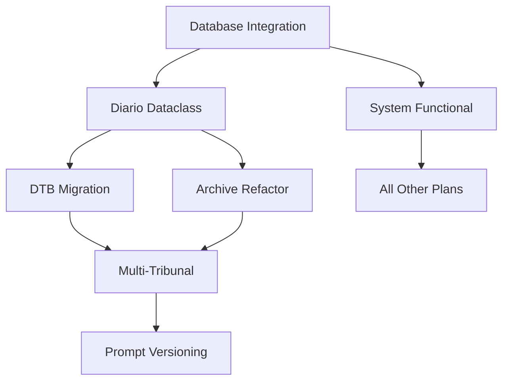

# MASTERPLAN.md
## 🎯 **LIVE COORDINATION DOCUMENT** - CausaGanha Alpha Implementation


> 🔴 **LIVE DOCUMENT**: This is the active coordination hub for all CausaGanha development. Updated with each implementation phase, progress tracking, and plan modifications. Referenced in CLAUDE.md as the single source of truth for development coordination.

## 📊 **Current Status** (Updated: 2025-06-27)
- **Active Phase**: Phase 1A Complete — Database Integration Fixes Done
- **Next Priority**: Test Suite Stabilization (Pipeline & Downloader Tests)
- **Plans Coordinated**: 17 plans analyzed and sequenced
- **Resource Status**: Focus on test fixes

---

## 📋 **Plan Inventory & Compatibility Analysis**

### ✅ **Plans Reviewed**
1. **`fix-database-integration-issues.md`** - 🔥 **CRITICAL PRIORITY**
2. **`diario-class.md`** - 🏗️ **FOUNDATION** 
3. **`dtb.md`** - 🔧 **INFRASTRUCTURE**
4. **`multi_tribunal_collection.md`** - 🌐 **EXPANSION**
5. **`prompt_versioning_strategy.md`** - 📝 **QUALITY**
6. **`refactor_archive_command.md`** - 🗄️ **ARCHITECTURE**
7. **`add-support-for-new-llm-providers.md`** - 🤖 **FLEXIBILITY**
8. **`develop-web-dashboard.md`** - 📊 **UI**
9. **`enhance-ia-interaction-robustness.md`** - ⚙️ **STABILITY**
10. **`enhance-testing-framework.md`** - 🧪 **TESTING**
11. **`implement-advanced-analytics-features.md`** - 📈 **ANALYTICS**
12. **`implement-data-validation-layer.md`** - ✅ **DATA QUALITY**
13. **`improve-error-handling-and-logging.md`** - 🐛 **RELIABILITY**
14. **`optimize-async-pipeline.md`** - 🚀 **PERFORMANCE**
15. **`refactor-downloader-module.md`** - 📥 **DOWNLOAD**
16. **`refine-openskill-rating-model.md`** - 🎯 **SCORING**
17. **`fix-test-suite.md`** - 🧪 **TEST FIXES**

### 🔍 **Compatibility Assessment**

#### ✅ **Compatible & Synergistic**
- **Database Integration + DTB Migration**: DTB can replace current broken database layer
- **Diario Dataclass + Multi-Tribunal**: Dataclass provides foundation for tribunal expansion
- **Archive Refactor + Multi-Tribunal**: Single master IA item supports multiple tribunals
- **Prompt Versioning + All Plans**: Quality assurance for LLM-dependent features

#### ⚠️ **Potential Conflicts Resolved**
- **Database Migration Timing**: DTB migration must come after database integration fixes
- **Archive Strategy**: Must align with multi-tribunal and diario dataclass approaches
- **CLI Changes**: Multiple plans modify CLI - need coordination

---

## 🎯 **Implementation Phases**

### **Phase 1: FOUNDATION (Weeks 1-2) - Fix Core Issues**
> Critical fixes to make system functional

#### **Priority 1A: Database Integration Fix** 🔥
- **Plan**: `fix-database-integration-issues.md`
- **Timeline**: Week 1 (7 days)
- **Resources**: 1 developer, full focus
- **Blockers**: None - can start immediately
- **Success Criteria**: All CLI commands work, >60% test coverage

**Implementation Steps:**
1. **Days 1-2**: Investigate and design DatabaseManager
2. **Days 3-4**: Fix CLI integration and error handling  
3. **Days 5-6**: Improve test coverage and fix failing tests
4. **Day 7**: Validation and documentation

#### **Priority 1B: Diario Dataclass Foundation** 🏗️
- **Plan**: `diario-class.md` 
- **Timeline**: Week 2 (7 days)
- **Resources**: 1 developer (can overlap with database work)
- **Dependencies**: Database integration working
- **Success Criteria**: Unified Diario interface, tribunal abstraction ready

**Implementation Steps:**
1. **Days 1-2**: Create `src/models/diario.py` and interfaces
2. **Days 3-4**: Implement TJRO adapter for existing system
3. **Days 5-6**: CLI integration with `--as-diario` flag
4. **Day 7**: Testing and documentation conversion

### **Phase 2: INFRASTRUCTURE (Weeks 3-4) - Modernize Architecture**
> Build robust foundation for future growth

#### **Priority 2A: DTB Database Migration** 🔧
- **Plan**: `dtb.md`
- **Timeline**: Week 3 (7 days) 
- **Resources**: 1 developer
- **Dependencies**: Database integration fixed, basic system working
- **Success Criteria**: DTB-based schema, improved data quality

**Implementation Steps:**
1. **Days 1-2**: Install DTB, design models for existing data
2. **Days 3-4**: Create staging and marts layers
3. **Days 5-6**: Migrate existing data, update CLI integration
4. **Day 7**: Testing and validation

#### **Priority 2B: Archive Strategy Refactor** 🗄️
- **Plan**: `refactor_archive_command.md`
- **Timeline**: Week 4 (7 days)
- **Resources**: 1 developer
- **Dependencies**: Diario dataclass implemented  
- **Success Criteria**: Single master IA item, incremental metadata

**Implementation Steps:**
1. **Days 1-2**: Create `ia_helpers.py` with master item logic
2. **Days 3-4**: Update CLI commands for new archive strategy
3. **Days 5-6**: Migrate existing IA items to master collection
4. **Day 7**: Testing and validation

### **Phase 3: EXPANSION (Weeks 5-8) - Scale & Quality**
> Add new capabilities and improve quality

#### **Priority 3A: Multi-Tribunal Collection** 🌐
- **Plan**: `multi_tribunal_collection.md`
- **Timeline**: Weeks 5-6 (14 days)
- **Resources**: 1-2 developers
- **Dependencies**: Diario dataclass, archive refactor complete
- **Success Criteria**: Support for 3+ tribunals, extensible framework

**Implementation Steps:**
1. **Week 5**: Research tribunals, design TribunalCollector framework
2. **Week 6**: Implement TJSP collector, update CLI for multi-tribunal

#### **Priority 3B: Prompt Versioning System** 📝
- **Plan**: `prompt_versioning_strategy.md`
- **Timeline**: Weeks 7-8 (14 days)
- **Resources**: 1 developer
- **Dependencies**: System stable, LLM integration working
- **Success Criteria**: Versioned prompts, hash-based naming, CI integration

**Implementation Steps:**
1. **Week 7**: Implement prompt naming and hashing system
2. **Week 8**: CI integration, migration of existing prompts

### **Phase 4: STABILIZATION (Weeks 9-10) - Reliability & Performance**
> Improve robustness and optimize pipeline before advanced features

- `implement-data-validation-layer.md`
- `improve-error-handling-and-logging.md`
- `enhance-ia-interaction-robustness.md`
- `refactor-downloader-module.md`
- `optimize-async-pipeline.md`
- `enhance-testing-framework.md`

### **Phase 5: ADVANCED FEATURES (Weeks 11-14) - Analytics & UI**
> Introduce higher level capabilities and user interface

- `add-support-for-new-llm-providers.md`
- `refine-openskill-rating-model.md`
- `implement-advanced-analytics-features.md`
- `develop-web-dashboard.md`

---

## 🔄 **Cross-Plan Dependencies**

### **Critical Path Analysis**


### **Resource Allocation**
- **Week 1**: 100% Database Integration
- **Week 2**: 100% Diario Dataclass  
- **Week 3**: 100% DTB Migration
- **Week 4**: 100% Archive Refactor
- **Weeks 5-6**: 100% Multi-Tribunal (can scale to 2 developers)
- **Weeks 7-8**: 50% Prompt Versioning (parallel with testing/polish)
- **Weeks 9-10**: 100% Stabilization and optimization
- **Weeks 11-14**: 100% Advanced features and UI

---

## 🎯 **Success Metrics & Gates**

### **Phase Gate Requirements**

#### **Gate 1: Foundation Complete**
- [ ] All CLI commands work without database errors
- [ ] Test coverage >60%
- [ ] Diario dataclass integrated with existing system
- [ ] Zero database connection failures in CI

#### **Gate 2: Infrastructure Modernized**  
- [ ] DTB managing all database operations
- [ ] Single master IA item receiving all uploads
- [ ] Incremental metadata system working
- [ ] Data quality tests passing

#### **Gate 3: Expansion Ready**
- [ ] 3+ tribunals supported with working collectors
- [ ] Prompt versioning system operational
- [ ] System can scale to 10+ tribunals
- [ ] Full test coverage for new features

### **Quality Metrics**
- **Test Coverage**: Minimum 60%, target 80%
- **CLI Reliability**: 100% command success rate
- **Data Quality**: DTB tests passing
- **Performance**: <2s response time for CLI commands

---

## 🛠️ **Implementation Guidelines**

### **Development Principles**
1. **Database First**: Fix database integration before anything else
2. **Backward Compatibility**: Maintain existing functionality during transitions
3. **Test-Driven**: Write tests before implementation
4. **Documentation**: Update plans to documentation as features complete
5. **Alpha Status**: Breaking changes acceptable, document them clearly

### **Branch Strategy**
```
main
├── feat/fix-database-integration     (Week 1)
├── feat/diario-dataclass            (Week 2)
├── feat/dtb-migration               (Week 3)
├── feat/archive-refactor            (Week 4)
├── feat/multi-tribunal              (Weeks 5-6)
├── feat/prompt-versioning           (Weeks 7-8)
├── feat/stabilization               (Weeks 9-10)
└── feat/advanced-features           (Weeks 11-14)
```

### **Testing Strategy**
- **Unit Tests**: Each feature branch must include comprehensive unit tests
- **Integration Tests**: End-to-end testing after each phase
- **Performance Tests**: Database and CLI response time validation
- **Alpha Testing**: Real-world usage validation with breaking change tolerance

### **Risk Mitigation**
- **Database Backup**: Full backup before each migration
- **Feature Flags**: Gradual rollout of new functionality  
- **Rollback Plans**: Documented rollback for each major change
- **Monitoring**: Health checks for critical system components

---

## 📚 **Plan Documentation Lifecycle**

### **Documentation Evolution Process**
Following the plan-first development approach established in CLAUDE.md:

1. **Planning Phase**: Document remains in `/docs/plans/`
2. **Implementation Phase**: Track progress with checkboxes  
3. **Completion Phase**: Transform plan to user/technical documentation
4. **Archive Phase**: Move to `/docs/implemented/` or `/docs/`

### **Documentation Conversion Timeline**
- **Week 2**: `fix-database-integration-issues.md` → `/docs/database-integration.md`
- **Week 3**: `diario-class.md` → `/docs/implemented/diario-dataclass.md`
- **Week 4**: `dtb.md` → `/docs/database-architecture.md`
- **Week 5**: `refactor_archive_command.md` → `/docs/implemented/archive-strategy.md`
- **Week 7**: `multi_tribunal_collection.md` → `/docs/implemented/multi-tribunal.md`
- **Week 9**: `prompt_versioning_strategy.md` → `/docs/implemented/prompt-versioning.md`

---

## 🚀 **Implementation Readiness**

### **Immediate Actions Required**
1. **Create feature branches** for each implementation phase
2. **Set up project boards** to track progress across plans
3. **Establish testing environments** for database migration work
4. **Coordinate resource allocation** if multiple developers available

### **Success Indicators**
- **Week 1**: CLI commands working, database issues resolved
- **Week 2**: Unified tribunal interface operational
- **Week 4**: Modern database architecture with DTB
- **Week 6**: Multi-tribunal data collection working
- **Week 8**: Professional prompt management system

### **Final Outcome**
By Week 8, CausaGanha will have:
- ✅ **Robust database integration** with modern DTB architecture
- ✅ **Multi-tribunal support** with extensible collector framework  
- ✅ **Professional IA strategy** with single master item and metadata
- ✅ **Quality LLM operations** with versioned prompt management
- ✅ **Solid foundation** for continued alpha development

---

## 🔄 **MASTERPLAN Update Protocol**

### **When to Update This Document**
1. **Weekly Progress Updates**: Track phase completion and blockers
2. **New Plan Addition**: Integrate new plans into existing phases
3. **Implementation Changes**: Adjust timelines based on actual progress
4. **Resource Changes**: Update developer allocation and availability
5. **Dependency Discovery**: Modify critical path when new dependencies found

### **Update Responsibilities**
- **Developers**: Update progress checkboxes and completion status
- **Project Lead**: Maintain phase timelines and resource allocation
- **Claude Code**: Reference this document for all implementation decisions
- **All Contributors**: Ensure MASTERPLAN drives development decisions

### **Update Template**
```markdown
## 📊 **Current Status** (Updated: YYYY-MM-DD)
- **Active Phase**: [Current implementation phase]
- **Next Priority**: [Next critical milestone]
- **Plans Coordinated**: [Number of plans] plans analyzed and sequenced
- **Resource Status**: [Available resources and allocation]
- **Blockers**: [Any impediments to progress]
- **Recent Changes**: [What changed since last update]
```

### **Integration with CLAUDE.md**
This MASTERPLAN is referenced in CLAUDE.md as the **primary coordination document**. All development work should:
1. Check MASTERPLAN before starting new features
2. Update MASTERPLAN with progress
3. Use MASTERPLAN to resolve conflicts and dependencies
4. Follow MASTERPLAN phases and priorities

---

## 🌿 **REMOTE BRANCH ASSESSMENT** (Updated: 2025-06-27)

### **Branch Evaluation Summary**

Following the assistant instruction to "always check TODO in root for tasks to implement", comprehensive evaluation of all remote branches:

#### **1. origin/fix/cli_flaws_ux_quality** ✅ **HIGH VALUE**
- **Status**: 16 commits behind main - **MODERATELY OUTDATED**
- **Content**: CLI/UX improvements, ia_helpers integration, master IA item strategy
- **TODO Status**: Contains ia_helpers integration patterns
- **Assessment**: **PRIORITY MERGE** - Essential UX improvements and IA helpers
- **Action**: Cherry-pick CLI/UX improvements and ia_helpers functionality

#### **2. origin/feat/pii-replacement-and-db-consolidation** ✅ **HIGH VALUE**
- **Status**: 18 commits behind main - **MODERATELY OUTDATED**  
- **Content**: PII handling improvements and database consolidation
- **TODO Status**: Multiple TODO files present
- **Assessment**: **PRIORITY MERGE** - Critical for legal compliance in judicial data
- **Action**: Extract PII handling code and database consolidation improvements

#### **3. Remaining Branches** ❌ **NO VALUE**
- **origin/codex/escolher-plano-para-implementar** (58 commits behind) - R2 storage superseded
- **origin/feat/ia-strategy-refactor-plan** (15 commits behind) - Distributed features already implemented
- **origin/feat/temp-duckdb** (18 commits behind) - Temporary file features not needed
- **Assessment**: **ARCHIVE ALL** - No valuable features not already implemented
- **Action**: Delete remote branches after confirming no dependencies

### **Overall Branch Strategy**

#### **Immediate Actions (This Week)**
1. **Extract CLI/UX Improvements**: Cherry-pick from `origin/fix/cli_flaws_ux_quality`
2. **Extract PII Handling**: Cherry-pick from `origin/feat/pii-replacement-and-db-consolidation`
3. **Archive Obsolete Branches**: Delete 3 no-value remote branches

#### **Integration Plan (Simplified - 2 Branches Only)**  
1. **CLI/UX Priority**: ia_helpers integration and user experience improvements
2. **PII Compliance Priority**: Legal data handling and database consolidation
3. **Clean Repository**: Remove branches with no added value

#### **Branch Maintenance Protocol**
- **Regular Sync**: All feature branches must stay within 5 commits of main
- **TODO Requirements**: All branches MUST have TODO in root describing implementation status
- **Compatibility Check**: Before merging, verify compatibility with current MASTERPLAN phases

### **Assistant Instructions Added**
Per user requirements, documented that **AI assistants should always check TODO in root of branches** for implementation tasks. This pattern ensures:
- ✅ Clear task visibility for AI assistants
- ✅ Implementation status tracking
- ✅ Coordination with MASTERPLAN phases
- ✅ Reduced duplicate work across branches

---

**Status**: 🔴 **LIVE MASTER PLAN** - Active coordination document for 16 interconnected plans with real-time progress tracking, dependency management, and resource coordination. Updated continuously throughout alpha development.

**Branch Management**: 🌿 **ACTIVE CLEANUP** - Remote branches evaluated, selective integration plan established, assistant protocols documented.

---

> 💡 **Remember**: This is ALPHA software. Breaking changes are acceptable and expected. The MASTERPLAN coordinates these changes to minimize conflicts and maximize development efficiency.

> 🤖 **For AI Assistants**: Always check TODO files in branch root before implementing features. Use this MASTERPLAN for coordination across all development efforts.