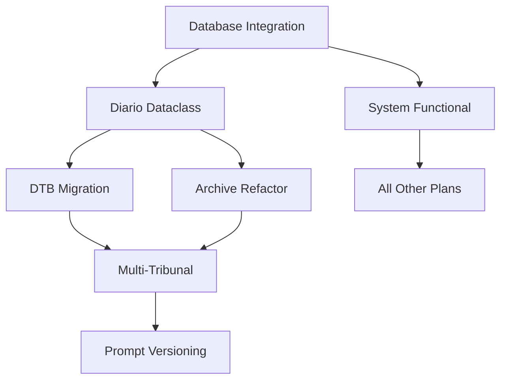

# MASTERPLAN.md
## Coordinated Implementation Strategy for CausaGanha Alpha


> 🎯 **Master Coordination Document**: This document coordinates the implementation of all plans in `/docs/plans/` to ensure compatibility, proper sequencing, and resource allocation.

---

## 📋 **Plan Inventory & Compatibility Analysis**

### ✅ **Plans Reviewed**
1. **`fix-database-integration-issues.md`** - 🔥 **CRITICAL PRIORITY**
2. **`diario-class.md`** - 🏗️ **FOUNDATION** 
3. **`dtb.md`** - 🔧 **INFRASTRUCTURE**
4. **`multi_tribunal_collection.md`** - 🌐 **EXPANSION**
5. **`prompt_versioning_strategy.md`** - 📝 **QUALITY**
6. **`refactor_archive_command.md`** - 🗄️ **ARCHITECTURE**

### 🔍 **Compatibility Assessment**

#### ✅ **Compatible & Synergistic**
- **Database Integration + DTB Migration**: DTB can replace current broken database layer
- **Diario Dataclass + Multi-Tribunal**: Dataclass provides foundation for tribunal expansion
- **Archive Refactor + Multi-Tribunal**: Single master IA item supports multiple tribunals
- **Prompt Versioning + All Plans**: Quality assurance for LLM-dependent features

#### ⚠️ **Potential Conflicts Resolved**
- **Database Migration Timing**: DTB migration must come after database integration fixes
- **Archive Strategy**: Must align with multi-tribunal and diario dataclass approaches
- **CLI Changes**: Multiple plans modify CLI - need coordination

---

## 🎯 **Implementation Phases**

### **Phase 1: FOUNDATION (Weeks 1-2) - Fix Core Issues**
> Critical fixes to make system functional

#### **Priority 1A: Database Integration Fix** 🔥
- **Plan**: `fix-database-integration-issues.md`
- **Timeline**: Week 1 (7 days)
- **Resources**: 1 developer, full focus
- **Blockers**: None - can start immediately
- **Success Criteria**: All CLI commands work, >60% test coverage

**Implementation Steps:**
1. **Days 1-2**: Investigate and design DatabaseManager
2. **Days 3-4**: Fix CLI integration and error handling  
3. **Days 5-6**: Improve test coverage and fix failing tests
4. **Day 7**: Validation and documentation

#### **Priority 1B: Diario Dataclass Foundation** 🏗️
- **Plan**: `diario-class.md` 
- **Timeline**: Week 2 (7 days)
- **Resources**: 1 developer (can overlap with database work)
- **Dependencies**: Database integration working
- **Success Criteria**: Unified Diario interface, tribunal abstraction ready

**Implementation Steps:**
1. **Days 1-2**: Create `src/models/diario.py` and interfaces
2. **Days 3-4**: Implement TJRO adapter for existing system
3. **Days 5-6**: CLI integration with `--as-diario` flag
4. **Day 7**: Testing and documentation conversion

### **Phase 2: INFRASTRUCTURE (Weeks 3-4) - Modernize Architecture**
> Build robust foundation for future growth

#### **Priority 2A: DTB Database Migration** 🔧
- **Plan**: `dtb.md`
- **Timeline**: Week 3 (7 days) 
- **Resources**: 1 developer
- **Dependencies**: Database integration fixed, basic system working
- **Success Criteria**: DTB-based schema, improved data quality

**Implementation Steps:**
1. **Days 1-2**: Install DTB, design models for existing data
2. **Days 3-4**: Create staging and marts layers
3. **Days 5-6**: Migrate existing data, update CLI integration
4. **Day 7**: Testing and validation

#### **Priority 2B: Archive Strategy Refactor** 🗄️
- **Plan**: `refactor_archive_command.md`
- **Timeline**: Week 4 (7 days)
- **Resources**: 1 developer
- **Dependencies**: Diario dataclass implemented  
- **Success Criteria**: Single master IA item, incremental metadata

**Implementation Steps:**
1. **Days 1-2**: Create `ia_helpers.py` with master item logic
2. **Days 3-4**: Update CLI commands for new archive strategy
3. **Days 5-6**: Migrate existing IA items to master collection
4. **Day 7**: Testing and validation

### **Phase 3: EXPANSION (Weeks 5-8) - Scale & Quality**
> Add new capabilities and improve quality

#### **Priority 3A: Multi-Tribunal Collection** 🌐
- **Plan**: `multi_tribunal_collection.md`
- **Timeline**: Weeks 5-6 (14 days)
- **Resources**: 1-2 developers
- **Dependencies**: Diario dataclass, archive refactor complete
- **Success Criteria**: Support for 3+ tribunals, extensible framework

**Implementation Steps:**
1. **Week 5**: Research tribunals, design TribunalCollector framework
2. **Week 6**: Implement TJSP collector, update CLI for multi-tribunal

#### **Priority 3B: Prompt Versioning System** 📝
- **Plan**: `prompt_versioning_strategy.md`
- **Timeline**: Weeks 7-8 (14 days)
- **Resources**: 1 developer
- **Dependencies**: System stable, LLM integration working
- **Success Criteria**: Versioned prompts, hash-based naming, CI integration

**Implementation Steps:**
1. **Week 7**: Implement prompt naming and hashing system
2. **Week 8**: CI integration, migration of existing prompts

---

## 🔄 **Cross-Plan Dependencies**

### **Critical Path Analysis**


### **Resource Allocation**
- **Week 1**: 100% Database Integration
- **Week 2**: 100% Diario Dataclass  
- **Week 3**: 100% DTB Migration
- **Week 4**: 100% Archive Refactor
- **Weeks 5-6**: 100% Multi-Tribunal (can scale to 2 developers)
- **Weeks 7-8**: 50% Prompt Versioning (parallel with testing/polish)

---

## 🎯 **Success Metrics & Gates**

### **Phase Gate Requirements**

#### **Gate 1: Foundation Complete**
- [ ] All CLI commands work without database errors
- [ ] Test coverage >60%
- [ ] Diario dataclass integrated with existing system
- [ ] Zero database connection failures in CI

#### **Gate 2: Infrastructure Modernized**  
- [ ] DTB managing all database operations
- [ ] Single master IA item receiving all uploads
- [ ] Incremental metadata system working
- [ ] Data quality tests passing

#### **Gate 3: Expansion Ready**
- [ ] 3+ tribunals supported with working collectors
- [ ] Prompt versioning system operational
- [ ] System can scale to 10+ tribunals
- [ ] Full test coverage for new features

### **Quality Metrics**
- **Test Coverage**: Minimum 60%, target 80%
- **CLI Reliability**: 100% command success rate
- **Data Quality**: DTB tests passing
- **Performance**: <2s response time for CLI commands

---

## 🛠️ **Implementation Guidelines**

### **Development Principles**
1. **Database First**: Fix database integration before anything else
2. **Backward Compatibility**: Maintain existing functionality during transitions
3. **Test-Driven**: Write tests before implementation
4. **Documentation**: Update plans to documentation as features complete
5. **Alpha Status**: Breaking changes acceptable, document them clearly

### **Branch Strategy**
```
main
├── feat/fix-database-integration     (Week 1)
├── feat/diario-dataclass            (Week 2)  
├── feat/dtb-migration               (Week 3)
├── feat/archive-refactor            (Week 4)
├── feat/multi-tribunal              (Weeks 5-6)
└── feat/prompt-versioning           (Weeks 7-8)
```

### **Testing Strategy**
- **Unit Tests**: Each feature branch must include comprehensive unit tests
- **Integration Tests**: End-to-end testing after each phase
- **Performance Tests**: Database and CLI response time validation
- **Alpha Testing**: Real-world usage validation with breaking change tolerance

### **Risk Mitigation**
- **Database Backup**: Full backup before each migration
- **Feature Flags**: Gradual rollout of new functionality  
- **Rollback Plans**: Documented rollback for each major change
- **Monitoring**: Health checks for critical system components

---

## 📚 **Plan Documentation Lifecycle**

### **Documentation Evolution Process**
Following the plan-first development approach established in CLAUDE.md:

1. **Planning Phase**: Document remains in `/docs/plans/`
2. **Implementation Phase**: Track progress with checkboxes  
3. **Completion Phase**: Transform plan to user/technical documentation
4. **Archive Phase**: Move to `/docs/implemented/` or `/docs/`

### **Documentation Conversion Timeline**
- **Week 2**: `fix-database-integration-issues.md` → `/docs/database-integration.md`
- **Week 3**: `diario-class.md` → `/docs/implemented/diario-dataclass.md`
- **Week 4**: `dtb.md` → `/docs/database-architecture.md`
- **Week 5**: `refactor_archive_command.md` → `/docs/implemented/archive-strategy.md`
- **Week 7**: `multi_tribunal_collection.md` → `/docs/implemented/multi-tribunal.md`
- **Week 9**: `prompt_versioning_strategy.md` → `/docs/implemented/prompt-versioning.md`

---

## 🚀 **Implementation Readiness**

### **Immediate Actions Required**
1. **Create feature branches** for each implementation phase
2. **Set up project boards** to track progress across plans
3. **Establish testing environments** for database migration work
4. **Coordinate resource allocation** if multiple developers available

### **Success Indicators**
- **Week 1**: CLI commands working, database issues resolved
- **Week 2**: Unified tribunal interface operational
- **Week 4**: Modern database architecture with DTB
- **Week 6**: Multi-tribunal data collection working
- **Week 8**: Professional prompt management system

### **Final Outcome**
By Week 8, CausaGanha will have:
- ✅ **Robust database integration** with modern DTB architecture
- ✅ **Multi-tribunal support** with extensible collector framework  
- ✅ **Professional IA strategy** with single master item and metadata
- ✅ **Quality LLM operations** with versioned prompt management
- ✅ **Solid foundation** for continued alpha development

---

**Status**: 📋 **MASTER PLAN ACTIVE** - Coordinated implementation strategy for 6 interconnected plans with clear phases, dependencies, and success criteria. Ready for execution with proper resource allocation and risk management.

---

> 💡 **Remember**: This is ALPHA software. Breaking changes are acceptable and expected. Focus on building the right architecture even if it requires significant refactoring of existing code.