# MASTERPLAN.md
## 🎯 **LIVE COORDINATION DOCUMENT** - CausaGanha Alpha Implementation

> 🔴 **LIVE DOCUMENT**: This is the active coordination hub for all CausaGanha development. Updated with each implementation phase, progress tracking, and plan modifications. Referenced in CLAUDE.md as the single source of truth for development coordination.

## 📊 **Current Status** (Updated: 2025-06-28)
- **Active Phase**: Database Integration Complete ✅ → System Integration Resolution In Progress
- **Next Priority**: Pipeline consolidation and unified CLI implementation
- **Plans Coordinated**: 18 interconnected plans with clear sequencing
- **Parallel Development**: Sprint `sprint-2025-01` active with 4 agents (5/20 tasks completed ✅)
- **Recent Changes**: Sprint work integration complete - VS Code, tests, docs, environment validation merged

---

## 📋 **Plan Overview & Implementation Phases**

### **Phase 1: FOUNDATION ✅ COMPLETED**
Critical system fixes and infrastructure

#### **✅ Database Integration Fix** - `fix-database-integration-issues.md`
- All CLI commands working, 105 tests passing
- DuckDB with 20 tables, proper schema
- Internet Archive synchronization functional

#### **✅ Test Suite Stabilization** - `fix-test-suite.md`  
- All pipeline tests fixed and passing
- Enhanced downloader with IA integration
- End-to-end testing complete

#### **🔄 System Integration Resolution** - `system-integration-resolution.md` **IN PROGRESS**
- **Week 1**: Pipeline consolidation and argument standardization
- **Week 2**: Extract & analyze integration with real data processing
- **Week 3**: Unified CLI implementation and database synchronization

### **Phase 2: INFRASTRUCTURE** (Weeks 3-4)
Modern architecture and data management

#### **Priority 2A: Diario Dataclass Foundation** - `diario-class.md`
- Unified Diario interface for tribunal abstraction
- TJRO adapter integration with existing system
- **Dependencies**: System integration complete

#### **Priority 2B: DTB Database Migration** - `dtb.md`
- DTB-based schema with improved data quality
- Staging and marts layers for analytics
- **Dependencies**: Basic system working, dataclass implemented

#### **Priority 2C: Archive Strategy Refactor** - `refactor_archive_command.md`
- Single master IA item with incremental metadata
- Unified archive commands across tribunals
- **Dependencies**: Diario dataclass, system integration complete

### **Phase 3: EXPANSION** (Weeks 5-8)
Scale and new capabilities

#### **Multi-Tribunal Collection** - `multi_tribunal_collection.md`
- Support for 3+ tribunals with extensible framework
- **Dependencies**: Diario dataclass, archive refactor complete

#### **Prompt Versioning System** - `prompt_versioning_strategy.md`
- Versioned prompts with hash-based naming
- CI integration for quality assurance
- **Dependencies**: System stable, LLM integration working

### **Phase 4: ADVANCED FEATURES** (Weeks 9+)
Analytics, monitoring, and user interface

#### **Stabilization Plans** (9 plans)
- Data validation, error handling, IA robustness
- Testing framework, async optimization
- Downloader module improvements

#### **Advanced Features** (4 plans)
- Additional LLM providers, OpenSkill refinements
- Advanced analytics, web dashboard

---

## 🤖 **Parallel Development System**

### **Agent Registry** - Current Sprint: `sprint-2025-01`
Parallel development managed through `.agents/` directory:

| Agent | Specialization | Branch | Progress |
|-------|---------------|--------|----------|
| **jules1** | Testing & Documentation | `feat/sprint-2025-01-jules1` | 2/5 tasks ✅ |
| **jules2** | Quality & Documentation | `feat/sprint-2025-01-jules2` | 1/5 tasks ✅ |
| **codex1** | Infrastructure & DevEx | `feat/sprint-2025-01-codex1` | 1/5 tasks ✅ |
| **gemini1** | Monitoring & Integration | `feat/sprint-2025-01-gemini1` | 1/5 tasks ✅ |

**Benefits**: Zero-conflict development, file boundary enforcement, sprint-based delivery
**Timeline**: 2-3 weeks parallel to main development phases
**Details**: See `.agents/README.md` for complete assignments and coordination

---

## 🔄 **Critical Path & Dependencies**

### **Implementation Sequence**

```mermaid
graph TD
    A[Database Integration ✅] --> B[System Integration 🔄]
    B --> C[Diario Dataclass]
    B --> D[DTB Migration]
    C --> E[Archive Refactor]
    D --> E
    E --> F[Multi-Tribunal]
    F --> G[Advanced Features]
    
    H[Agent Sprint 🔄] --> I[Quality Improvements]
    I --> G
```

### **Resource Coordination**
- **Main Team**: Focus on critical path (system integration → infrastructure → expansion)
- **Agent Team**: Parallel improvements (testing, docs, tooling, monitoring)
- **Merge Strategy**: Agent sprints merge into main between phases
- **Conflict Prevention**: File boundaries ensure clean integration

---

## 🎯 **Success Metrics & Quality Gates**

### **Phase Gates**
- **Phase 1 Complete ✅**: All CLI commands work, >60% test coverage, database stable
- **Phase 2 Ready**: System integration complete, unified CLI functional
- **Phase 3 Ready**: Modern architecture with DTB, single IA strategy
- **Production Ready**: Multi-tribunal support, comprehensive monitoring

### **Quality Standards**
- **Test Coverage**: Minimum 60%, target 80%
- **CLI Reliability**: 100% command success rate
- **Documentation**: All features documented with examples
- **Agent Deliverables**: All parallel work includes tests and documentation

---

## 🛠️ **Development Guidelines**

### **Alpha Status Management**
- **Breaking Changes**: Acceptable and expected, document clearly
- **Backward Compatibility**: Maintain during transitions when possible
- **Feature Flags**: Gradual rollout of new functionality
- **Documentation**: Keep CLAUDE.md updated with current capabilities

### **Branch Strategy & Coordination**
- **Main Development**: `feat/{phase-name}` for critical path work
- **Agent Sprints**: `feat/sprint-{id}-{agent}` for parallel development
- **Plan Implementation**: Create feature branch, implement, document, merge
- **Agent Coordination**: Single PR delivery at sprint completion

### **Plan Lifecycle**
1. **Planning**: New plans created in `/docs/plans/` with MASTERPLAN integration
2. **Implementation**: Feature development with progress tracking
3. **Documentation**: Transform plans to user/technical docs upon completion
4. **Archive**: Move completed plans to `/docs/implemented/` or `/docs/`

---

## 🌿 **Branch & Remote Management**

### **High-Value Remote Branches** ✅ INTEGRATED
- ~~**origin/fix/cli_flaws_ux_quality**: CLI/UX improvements, ia_helpers integration~~ **MERGED**
- ~~**origin/feat/pii-replacement-and-db-consolidation**: PII handling, database improvements~~ **MERGED**

### **Sprint Work Integration** ✅ COMPLETED
- **5 sprint branches merged**: VS Code config, IA discovery tests, environment validation, Sphinx docs, PDF chunking tests
- **Zero conflicts**: File boundary enforcement working perfectly
- **Quality maintained**: All tests passing (110 passed, 6 skipped)

---

## 🚀 **Implementation Readiness**

### **Immediate Priorities**
1. **Complete System Integration**: Unified CLI and pipeline consolidation
2. **Agent Sprint Continuation**: 15/20 tasks remaining in sprint-2025-01
3. **Phase 2 Preparation**: Ready infrastructure modernization plans  
4. **Quality Assurance**: Maintain test coverage and documentation standards

### **Success Vision**
By completion of coordinated phases, CausaGanha will have:
- ✅ **Unified System**: Single CLI, consolidated pipelines, modern architecture
- ✅ **Multi-Tribunal Support**: Extensible framework for judicial data collection
- ✅ **Professional Quality**: Comprehensive testing, documentation, and monitoring
- ✅ **Scalable Development**: Agent registry system for continued parallel improvements

---

**Status**: 🔴 **LIVE COORDINATION** - Active document coordinating 18 plans with real-time progress tracking, agent registry system, and phase-based implementation. System integration in progress, parallel development active.

**Agent Registry**: 🤖 **SPRINT PROGRESS** - `sprint-2025-01` with 4 agents (25% complete, 5/20 tasks delivered) delivering quality improvements parallel to main development.

---

> 💡 **Remember**: This is ALPHA software. Breaking changes are acceptable and expected. The MASTERPLAN coordinates these changes to minimize conflicts and maximize development efficiency.

> 🤖 **For AI Assistants**: 
> 1. **Check TODO files** in branch root before implementing features
> 2. **Use this MASTERPLAN** for coordination across all development efforts  
> 3. **Agent Registry** - Check `.agents/` directory for current sprint assignments
> 4. **Follow your agent file** - Individual task tracking and file boundaries in `.agents/{agent-name}.md`