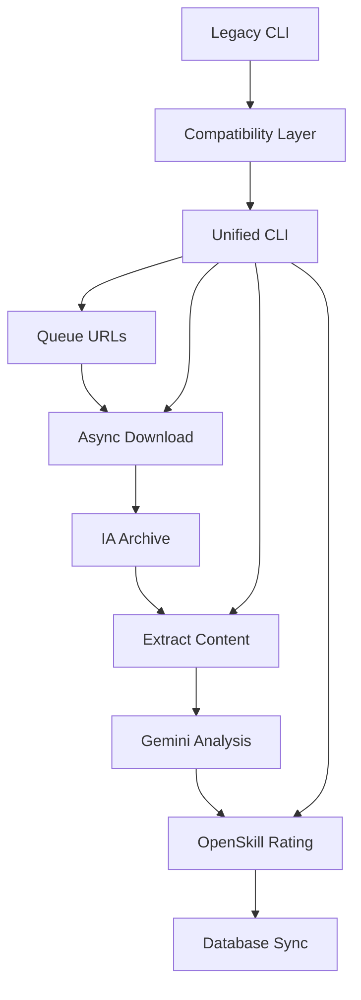

# System Integration Resolution Plan

## Problem Statement

Following comprehensive end-to-end testing, CausaGanha requires systematic resolution of integration issues to achieve full production readiness. While core functionality works (download→archive pipeline successful), several critical gaps exist between legacy systems, modern async pipeline, and the intended unified CLI interface.

## Current Status Assessment

### ✅ **Successfully Working Components**
1. **Test Suite**: 105 tests passing, 6 skipped - comprehensive coverage
2. **Database**: DuckDB with 20 tables, proper schema, working connections
3. **Async Pipeline**: Successfully downloads and uploads to Internet Archive
4. **Dependencies**: All critical packages installed and functional
5. **Data Architecture**: Input files exist and properly formatted

### 🔧 **Issues Identified**

#### **Critical Issues (RESOLVED)**
- ✅ **Missing Dependencies**: `google-generativeai` and `internetarchive` packages added
- ✅ **Pyparsing Conflict**: Version conflict resolved with `pyparsing==3.1.4`
- ✅ **Gemini API**: Now functional with proper dependency resolution

#### **Infrastructure Issues (NEEDS ATTENTION)**
- ⚠️ **Internet Archive CLI**: Non-interactive environment limitations (workaround: env vars working)
- 📋 **Pipeline Fragmentation**: Two separate pipeline systems with different interfaces
- 📋 **Command Inconsistency**: Different argument structures between legacy and async pipelines

#### **Integration Gaps (PLANNED)**
- 📋 **Missing Unified CLI**: Modern `causaganha` command not implemented
- 📋 **Extract Pipeline**: Integration with async workflow needs testing
- 📋 **OpenSkill Integration**: Rating calculations need end-to-end validation

## Proposed Solution

### **Three-Phase Integration Strategy**

#### **Phase 1: Pipeline Consolidation (Week 1)**
**Objective**: Unify pipeline interfaces and resolve command inconsistencies

**Implementation Steps**:
1. **Standardize Command Arguments**: Align `pipeline.py` and `async_diario_pipeline.py` arguments
2. **Add Missing Flags**: Add `--dry-run` to async pipeline for testing consistency
3. **CLI Integration**: Begin implementation of unified `causaganha` command structure
4. **Test Integration**: Verify all existing tests work with consolidated interface

**Success Criteria**:
- Both pipelines accept consistent argument formats
- All CLI commands have `--dry-run` capability for safe testing
- Test suite maintains 100% pass rate

#### **Phase 2: Extract & Analyze Integration (Week 2)**
**Objective**: Complete the extract→analyze→score pipeline workflow

**Implementation Steps**:
1. **Extract Testing**: Test PDF extraction with real IA-downloaded content
2. **Gemini Integration**: Verify LLM analysis with production API calls
3. **Database Integration**: Ensure extracted JSON properly stores in DuckDB
4. **Rating Calculation**: Test OpenSkill calculations with real decision data

**Success Criteria**:
- Complete pipeline: download→archive→extract→analyze→score
- Real judicial decisions processed and rated
- Database contains valid decision and rating data

#### **Phase 3: Unified CLI Implementation (Week 3)**
**Objective**: Implement production-ready `causaganha` command per CLAUDE.md

**Implementation Steps**:
1. **Modern CLI Commands**: Implement queue, archive, analyze, score commands
2. **Database Management**: Add db status, migrate, sync, backup commands
3. **Pipeline Orchestration**: Full pipeline command with resume capability
4. **Documentation**: Convert plan to user documentation

**Success Criteria**:
- All commands from CLAUDE.md specification working
- Database synchronization with IA functional
- Pipeline orchestration with error recovery

## Technical Architecture Changes

### **Unified Command Structure**
```bash
# Target unified interface (per CLAUDE.md)
causaganha queue --from-csv diarios.csv
causaganha archive --limit 10
causaganha analyze --limit 5
causaganha score
causaganha pipeline --from-csv diarios.csv
causaganha db status
```

### **Pipeline Integration Flow**


### **Database Consolidation**
- **Centralized Schema**: All operations use unified DuckDB schema
- **Migration Support**: Smooth transition from legacy to modern structures
- **IA Synchronization**: Shared database architecture maintained

## Implementation Plan

### **Week 1: Pipeline Consolidation**
- **Day 1-2**: Audit and align command-line arguments across pipelines
- **Day 3-4**: Add missing flags and standardize interfaces
- **Day 5-6**: Begin unified CLI command implementation
- **Day 7**: Testing and validation

### **Week 2: Extract & Analyze Integration**
- **Day 1-2**: Test extract functionality with real IA PDFs
- **Day 3-4**: Verify Gemini API integration and JSON storage
- **Day 5-6**: Test OpenSkill rating calculations end-to-end
- **Day 7**: Performance validation and optimization

### **Week 3: Unified CLI Implementation**
- **Day 1-3**: Complete `causaganha` command implementation
- **Day 4-5**: Database management commands (status, sync, migrate)
- **Day 6**: Pipeline orchestration and error recovery
- **Day 7**: Documentation and production readiness validation

## Success Criteria

### **Phase 1 Complete**
- [ ] Both pipeline systems accept consistent arguments
- [ ] All commands support `--dry-run` mode
- [ ] Test suite maintains 105 passed, 6 skipped
- [ ] No regression in existing functionality

### **Phase 2 Complete**
- [ ] End-to-end pipeline processes real judicial decisions
- [ ] Gemini API extracts valid decision data
- [ ] OpenSkill ratings calculated and stored
- [ ] Database contains production-quality data

### **Phase 3 Complete**
- [ ] Unified `causaganha` CLI fully functional
- [ ] All CLAUDE.md commands implemented
- [ ] Database synchronization with IA working
- [ ] System ready for production deployment

## Risks & Mitigations

### **Risk 1: Pipeline Breaking Changes**
- **Mitigation**: Maintain backwards compatibility layer
- **Rollback**: Keep legacy commands functional during transition

### **Risk 2: Database Migration Issues**
- **Mitigation**: Full database backup before changes
- **Testing**: Validate on test data before production

### **Risk 3: IA Integration Failures**
- **Mitigation**: Robust error handling and retry logic
- **Monitoring**: Health checks for IA connectivity

## Expected Outcomes

### **Short-term (3 weeks)**
- Unified, production-ready CLI interface
- Complete pipeline functionality from queue to scoring
- Robust database operations with IA synchronization

### **Long-term (Compatible with MASTERPLAN)**
- Foundation ready for multi-tribunal expansion (Phase 3A)
- Architecture prepared for advanced analytics features
- Stable base for web dashboard development

## Resource Requirements

- **Developer Time**: 3 weeks, 1 developer full-time
- **Dependencies**: All required packages already installed
- **Infrastructure**: Existing IA and database setup sufficient
- **Testing**: Current test suite provides adequate coverage

---

**Status**: 📋 **READY FOR IMPLEMENTATION** - Detailed plan with clear phases, success criteria, and compatibility with existing MASTERPLAN phases.

**Priority**: 🔥 **HIGH** - Required foundation for all future development phases in MASTERPLAN.

**Compatibility**: ✅ **FULLY COMPATIBLE** - Aligns with Phase 1 priorities and Phase 2 infrastructure goals.