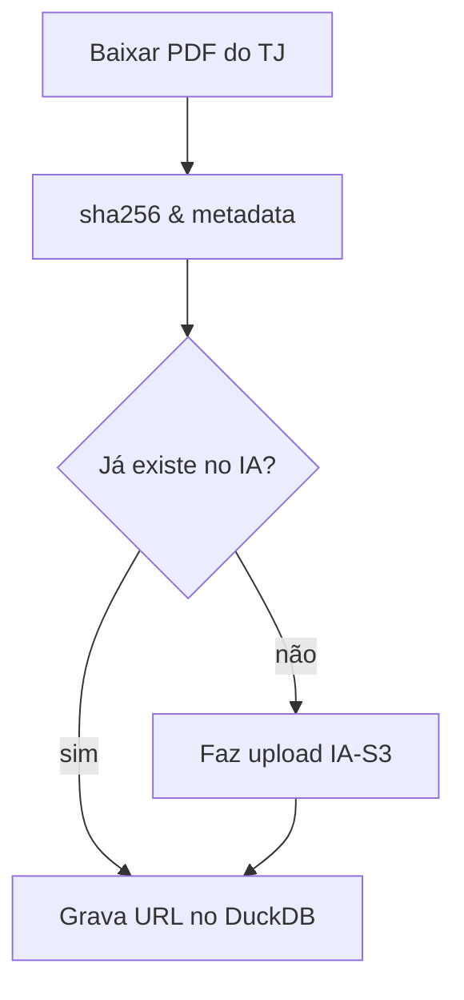

# Integração com Wayback/Archive.org

Este documento resume como arquivar PDFs do projeto no Internet Archive ("Wayback") usando a API S3-like. A estratégia garante perenidade, gera permalinks e evita custos locais de armazenamento.

## 1. Credenciais e Identificadores

1. Crie ou utilize sua conta no Archive.org e obtenha as chaves em <https://archive.org/account/s3.php>.
2. Cada item precisa de um identificador único. Utilize um slug determinístico:

```python
item_id = "cg-" + sha256[:12]
```

3. Use a API S3 para upload (`ia upload`), evitando o Save Page Now.
4. O Archive.org aceita arquivos de vários gigabytes; o limite prático é a sua banda de upload.

## 2. Fluxo no Pipeline



Exemplo de integração via CLI `internetarchive`:

```python
import hashlib, subprocess, pathlib, duckdb

PDF = pathlib.Path("tmp/2025-06-25-12345.pdf")
sha = hashlib.sha256(PDF.read_bytes()).hexdigest()
item_id = f"cg-{sha[:12]}"
fn = PDF.name

# verifica se já existe
exists = subprocess.run([
    "ia", "metadata", item_id, "--raw"
], capture_output=True, text=True).returncode == 0

if not exists:
    subprocess.check_call([
        "ia", "upload", item_id, str(PDF),
        "--metadata", "mediatype:texts",
        "--metadata", "subject:causa_ganha, trj:ro",
        "--metadata", f"sha256:{sha}",
        "--retries", "5"
    ])

archive_url = f"https://archive.org/download/{item_id}/{fn}"

con = duckdb.connect("causa_ganha.duckdb")
con.execute("""
    CREATE TABLE IF NOT EXISTS pdfs (
        sha256 TEXT PRIMARY KEY,
        item_id TEXT,
        ia_url TEXT
    );
""")
con.execute(
    "INSERT OR IGNORE INTO pdfs VALUES (?, ?, ?)",
    (sha, item_id, archive_url)
)
```

## 3. GitHub Actions

```yaml
name: IA-upload
on:
  workflow_dispatch:
  schedule:
    - cron: '15 3 * * *'

env:
  IA_ACCESS_KEY: ${{ secrets.IA_ACCESS_KEY }}
  IA_SECRET_KEY: ${{ secrets.IA_SECRET_KEY }}

jobs:
  upload:
    runs-on: ubuntu-latest
    steps:
      - uses: actions/checkout@v4
      - name: Install deps
        run: pip install internetarchive duckdb zstandard
      - name: Run collector + uploader
        run: python pipeline/collect_and_archive.py
```

## 4. Esquema DuckDB

```sql
CREATE TABLE pdfs (
    sha256 TEXT PRIMARY KEY,
    item_id TEXT NOT NULL,
    ia_url TEXT NOT NULL,
    origem_url TEXT,
    processo TEXT,
    data_publicacao DATE
);
```

## 5. Pontos de Atenção

| Risco                              | Mitigação                                               |
|------------------------------------|---------------------------------------------------------|
| Duplicidade de uploads             | ID usa `sha256` e `ia metadata` verifica antes          |
| Rate limit (1 req/s)               | `ia --retries 5 --delay 1`                              |
| PDFs sob sigilo                    | Filtrar antes: se `SegredoDeJustica` não arquivar       |
| Eventual takedown                  | Registrar hash e URL original para comprovar domínio público |
| Lock-in na IA                      | Hash + URL permitem reupload em outro serviço           |

## 6. Roadmap Simplificado

1. Chaves IA-S3 em `Actions Secrets` e teste manual do `ia`.
2. Função `archive_pdf()` integrada ao downloader.
3. Tabela `pdfs` criada e Action noturna funcionando.
4. Próxima sprint: worker que verifica 404 e reenvia se necessário.

---
Armazenar apenas hash e URL reduz custos e responsabilidade legal, mantendo o PDF acessível de forma permanente no Internet Archive.
